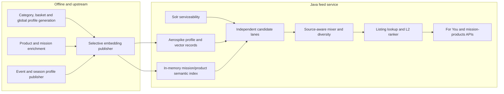
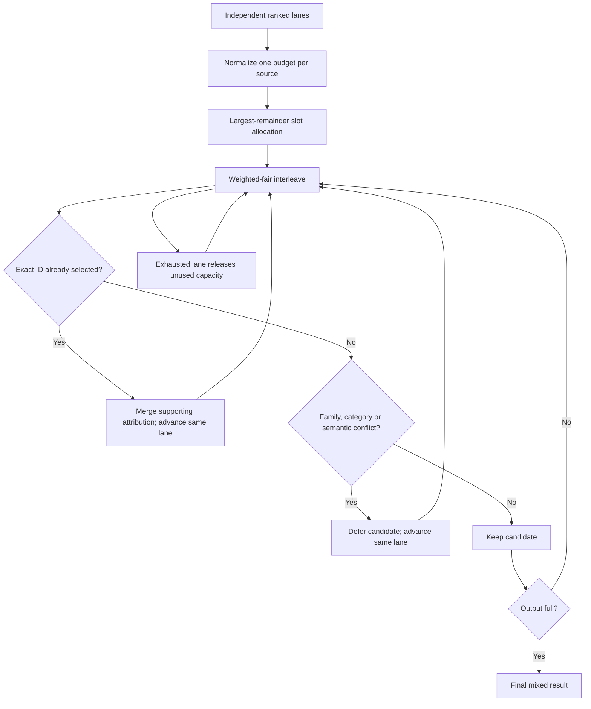
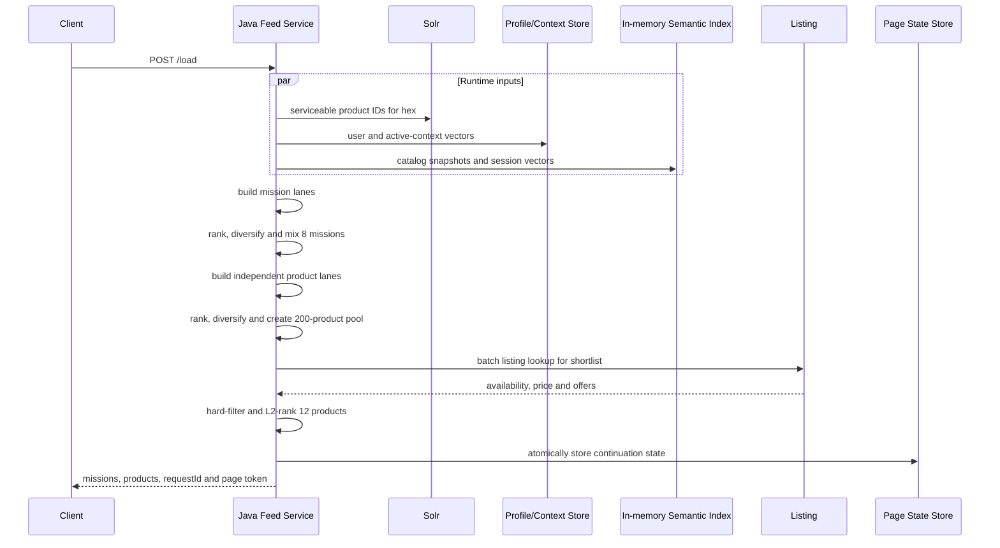

# Minutes Personalised Feed Service — Java Implementation Specification

## 1. What this service must build

Build a production Java service that serves two personalised Minutes feed APIs:

1. **For You:** independently returns a diversified list of missions and a
   diversified list of products.
2. **Mission products:** returns personalised products for one selected mission.

The service consumes user, catalog, event, season, location, and in-session
signals that have already been converted into vectors or ranked IDs. It performs
no LLM call and no embedding call at request time.

The central serving model is a **source-aware candidate mixer**. Category,
basket, global exploration, event, season, hex popularity, and in-session intent
are independent candidate sources. Each source produces its own ranked and
locally diversified queue. The mixer gives each source a configurable portion
of the result, deduplicates across sources, and backfills from the same source
before releasing unused capacity.

This is not one global cosine ranking. A category score and an event score answer
different questions and must not be compared as though they were calibrated.

### Frozen product-boundary decision

Homepage missions and homepage products are independent outputs:

```text
homepage product eligibility = Solr-serviceable product universe
```

A homepage product does not have to belong to a mission returned on that page.
Products from selected missions may provide a small feature-flagged boost. A
later experiment may represent all selected missions as one bounded source, but
the first Java implementation should use the boost only. Selected mission
membership is never a homepage gate.

For mission detail, membership is a hard boundary:

```text
mission-detail product eligibility
    = selected mission membership ∩ Solr serviceability
```

The mission-detail endpoint must never backfill with a product outside the
selected mission.

## 2. System boundary



### In scope

- resolving request daypart and weekday/weekend;
- fetching the serviceable product universe for a hex;
- loading precomputed user and context vectors;
- generating independent mission and product candidate lanes;
- lane-local ranking and diversity;
- source-normalized slot allocation and cross-lane mixing;
- creation of an internal product pool of up to 200 products;
- listing lookup and L2 ranking for a shortlist;
- initial page, load-more, and mission-detail behavior;
- idempotent page state, diagnostics, fallbacks, and metrics.

### Out of scope

- order aggregation;
- category, basket, or global LLM calls;
- product or mission text enrichment;
- embedding generation;
- deciding how another team physically stores raw profile summaries;
- real-time inference of an event or season from order history.

## 3. Non-negotiable serving rules

1. Runtime makes **zero LLM and zero embedding requests**.
2. Product serviceability is a hard filter before any product is returned.
3. Current listing availability is a hard filter after listing lookup.
4. Use base category and basket vectors plus only the exact current
   `dayType:daypart` vectors. Never activate an unrelated daypart profile.
5. Global exploration is independent of daypart.
6. Event and season lanes activate only from authoritative request context.
7. A source has one total importance budget. Adding more categories or queries
   cannot multiply that source's total influence.
8. Deduplicate exact entities across lanes. Retain their supporting-source
   attribution and advance the losing lane to its next candidate.
9. Preserve strong exact product affinity before applying broader category and
   family spacing.
10. If a lane cannot provide enough useful candidates, release its unused
    capacity deterministically. Do not reserve empty event or season slots.
11. Mission detail never crosses the mission-membership boundary.
12. Page tokens are opaque and idempotent. The same token returns the same page.

## 4. Runtime data contracts

These are logical contracts consumed by the Java service. Aerospike bins,
namespaces, compression, key names, snapshot files, and catalog-refresh
mechanisms may differ, but repositories must materialise these objects.

All vectors in one deployment use the same configured embedding space,
dimension, and normalization. Reject an incompatible record when it is loaded;
do not silently truncate or pad vectors.

### 4.1 User query-vector profile

```json
{
  "category": {
    "Milk": {
      "base": {
        "missionVectors": [
          {"queryOrder": 0, "weight": 1.0, "vector": [0.021, -0.104, 0.087]}
        ],
        "productVectors": [
          {"queryOrder": 0, "weight": 1.0, "vector": [0.041, -0.063, 0.112]},
          {"queryOrder": 1, "weight": 0.88, "vector": [0.038, -0.057, 0.101]},
          {"queryOrder": 2, "weight": 0.77, "vector": [0.029, -0.044, 0.094]}
        ]
      },
      "dayparts": {
        "weekday:afternoon": {
          "missionVectors": [
            {"queryOrder": 0, "weight": 1.0, "vector": [0.024, -0.097, 0.091]}
          ],
          "productVectors": [
            {"queryOrder": 0, "weight": 1.0, "vector": [0.043, -0.061, 0.109]}
          ]
        },
        "weekend:night": {
          "missionVectors": [
            {"queryOrder": 0, "weight": 1.0, "vector": [0.019, -0.083, 0.079]}
          ],
          "productVectors": [
            {"queryOrder": 0, "weight": 1.0, "vector": [0.040, -0.058, 0.104]}
          ]
        }
      }
    }
  },
  "basket": {
    "base": {
      "missionVectors": [
        {"queryOrder": 0, "weight": 1.0, "vector": [0.018, -0.071, 0.066]}
      ],
      "productVectors": [
        {"queryOrder": 0, "weight": 1.0, "vector": [0.031, -0.052, 0.089]}
      ]
    },
    "dayparts": {
      "weekend:afternoon": {
        "missionVectors": [
          {"queryOrder": 0, "weight": 1.0, "vector": [0.020, -0.069, 0.071]}
        ],
        "productVectors": [
          {"queryOrder": 0, "weight": 1.0, "vector": [0.033, -0.050, 0.091]}
        ]
      }
    }
  },
  "global": {
    "lanes": [
      {
        "name": "global",
        "missionVectors": [
          {"queryOrder": 0, "weight": 1.0, "vector": [0.014, -0.036, 0.075]}
        ],
        "productVectors": [
          {"queryOrder": 0, "weight": 1.0, "vector": [0.017, -0.039, 0.078]}
        ]
      }
    ]
  }
}
```

The vectors are shortened only for readability.

Rules:

- `category.<category>.base` is always active.
- Add `category.<category>.dayparts.<current dayType>:<current daypart>` only
  when that exact entry exists.
- Basket follows the same rule.
- Category product-query order is exact-to-broad. Its publisher provides the
  decreasing `weight`; feed does not reconstruct this ordering from text.
- Basket and global queries represent separate ideas and normally use equal
  weight unless their publisher explicitly provides another value.
- Query text is not required in the runtime record. It may exist in a secured
  diagnostic view but must not be required to rank.
- The profile repository may return a revision outside this semantic payload
  for cache invalidation and page consistency. It is not LLM content.

#### Route-aware global exploration

The preferred global publisher uses a reviewed analytical-category jump map.
Each exploratory route may be preserved as a global sub-lane:

```json
{
  "name": "Milk->BreakfastCereals",
  "sourceCategory": "Milk",
  "targetCategory": "BreakfastCereals",
  "missionVectors": [
    {"queryOrder": 0, "weight": 1.0, "vector": [0.014, -0.036, 0.075]}
  ],
  "productVectors": [
    {"queryOrder": 0, "weight": 1.0, "vector": [0.017, -0.039, 0.078]}
  ]
}
```

All global sub-lanes still share one global source budget. Ten global routes do
not receive ten times the importance of one route.

When `targetCategory` is present:

- product retrieval for that route is restricted to that analytical category;
- mission retrieval may prefer or restrict to missions covering that category,
  controlled by configuration;
- invalid or unavailable target categories are skipped.

For backward compatibility, a flat `global` lane without a target category is
semantic-only. The first Java version must support both shapes.

### 4.2 Event and season vectors

Event and season records have the same mission/product split but are keyed by an
authoritative context ID:

```json
{
  "contextType": "event",
  "contextId": "matchday",
  "missionVectors": [
    {"queryOrder": 0, "weight": 1.0, "vector": [0.071, -0.022, 0.104]}
  ],
  "productVectors": [
    {"queryOrder": 0, "weight": 1.0, "vector": [0.062, -0.019, 0.097]}
  ]
}
```

The request activates the ID. The feed service must not generate context text
or infer an event merely because a timestamp is present.

### 4.3 Product semantic record

The hot product catalog/index needs:

```json
{
  "productId": "P90210",
  "title": "Amul Taaza Pasteurised Toned Milk 500 ml",
  "category": "Milk",
  "productFamily": "Milk|amul taaza",
  "brand": "Amul",
  "variant": "toned milk",
  "packSize": "500 ml",
  "orders": 4819292,
  "vector": [0.041, -0.063, 0.112]
}
```

`productFamily` is a stable, pack-insensitive product-line key. It prevents
multiple pack sizes of the same line from occupying the visible result. It must
be produced offline from catalog facts, not generated differently on every
service instance.

The product vector must encode factual product identity: title, analytical
category, brand, variant/form, quantity/pack, and enriched purpose. Listing
price, offer, and current availability do not belong in this vector.

### 4.4 Mission semantic record

```json
{
  "missionId": "M104",
  "title": "Everyday Milk Restock",
  "description": "Restock familiar milk formats and practical household packs.",
  "missionFamily": "dairy_and_protein",
  "missionClass": "category",
  "missionType": "broad",
  "eligibility": "feed",
  "dayparts": ["anytime"],
  "seasons": ["all_season"],
  "analyticalCategories": ["Milk"],
  "productIds": ["P90210", "P90211"],
  "vector": [0.024, -0.097, 0.091]
}
```

The mission catalog is authoritative for mission eligibility, display fields,
family, semantic vector, analytical categories, and product membership.

### 4.5 Solr serviceability response

The Java repository should expose this logical operation:

```java
ServiceableCatalog getServiceableProducts(String hexId);
```

Minimum result:

```json
{
  "hexId": "HEX-42",
  "productIds": ["P90210", "P90211", "P7721"]
}
```

The Solr query is the coarse runtime product boundary. If Solr also returns
category, seller, or inventory keys, the adapter may retain them, but feed
ranking must use canonical in-memory product metadata for semantic identity.

### 4.6 Hex popularity

Hex popularity is already ranked and does not need a query vector:

```json
{
  "hexId": "HEX-42",
  "missionCandidates": [
    {"missionId": "M104", "score": 0.93}
  ],
  "productCandidates": [
    {"productId": "P90210", "score": 0.98}
  ]
}
```

Scores must be normalized to `[0, 1]` inside this source. They are lane-local
scores; they are not compared directly with cosine similarity from another
source.

### 4.7 In-session events

```json
{
  "eventType": "product_view",
  "entityId": "P7721",
  "timestamp": "2026-07-23T18:35:10+05:30"
}
```

Supported first-release types:

- `product_view`;
- `product_click`;
- `add_to_cart`;
- `mission_view`;
- `mission_click`.

The service looks up the interacted product or mission vector already in
memory. Unknown IDs are ignored. Stronger actions may receive larger local
query weights, for example view `0.6`, click `0.8`, and add-to-cart `1.0`.
Weights and recency decay are configuration, not API behavior.

## 5. Public API contracts

Both endpoints use `POST` because the request contains user and session state.
Unknown context fields are ignored for forward compatibility. Invalid values of
known fields return `400`.

### 5.1 For You and load more

```text
POST /api/v1/mission-feed/load
```

Initial request:

```json
{
  "userId": "U123",
  "hexId": "HEX-42",
  "context": {
    "timestamp": "2026-07-23T18:32:00+05:30",
    "eventIds": ["matchday"],
    "seasonId": "monsoon"
  },
  "sessionEvents": []
}
```

Required:

- `userId`;
- `hexId`;
- `context.timestamp`, including timezone offset.

The service derives local `daypart` and `dayType` from the timestamp. A trusted
gateway may pass resolved values internally, but public clients must not be
responsible for matching Minutes daypart rules.

Initial Minutes daypart boundaries in the timestamp's local timezone are:

| Daypart | Local hour |
| --- | --- |
| `morning` | `05:00` to before `11:00` |
| `afternoon` | `11:00` to before `16:00` |
| `evening` | `16:00` to before `21:00` |
| `night` | `21:00` to before `05:00` |

`dayType` is `weekend` for Saturday/Sunday and `weekday` otherwise. Keep these
rules in one `ContextResolver`; profile generation and feed serving must share
the same definition.

Initial response:

```json
{
  "requestId": "REQ-901",
  "missions": [
    {
      "missionId": "M104",
      "title": "Everyday Milk Restock"
    }
  ],
  "products": [
    {
      "productId": "P90210",
      "title": "Amul Taaza Pasteurised Toned Milk 500 ml",
      "listing": {
        "available": true,
        "price": 29.0,
        "mrp": 30.0,
        "offerText": null
      }
    }
  ],
  "nextPageToken": "opaque-token",
  "hasMore": true
}
```

Serving target when supply permits:

- 8 missions by default, configurable from 8–12;
- 12 visible products on the initial page;
- up to 200 unique products retained in request state for quality and load more.

The 200-product pool is internal. Do not send 200 listing-enriched products to
the client unless the product contract is explicitly changed; listing lookup
and payload cost should be paid only for the visible shortlist.

Load-more request uses the same endpoint:

```json
{
  "userId": "U123",
  "hexId": "HEX-42",
  "parentRequestId": "REQ-901",
  "pageToken": "opaque-token",
  "context": {
    "timestamp": "2026-07-23T18:36:00+05:30",
    "eventIds": ["matchday"],
    "seasonId": "monsoon"
  },
  "sessionEvents": [
    {
      "eventType": "product_view",
      "entityId": "P7721",
      "timestamp": "2026-07-23T18:35:10+05:30"
    }
  ]
}
```

Load-more behavior:

1. Validate that token, user, hex, and parent request belong together.
2. Load the remaining candidate pool and already-shown IDs.
3. Add or refresh the in-session lane from events after the parent request.
4. Rerank only unseen candidates; never reorder items already returned.
5. Re-run diversity against the recent shown-item window so page boundaries do
   not create immediate family/category repeats.
6. Fetch listings for the new shortlist, remove unavailable items, and backfill
   from the remaining pool.
7. Persist the next state before returning the page.

The same `pageToken` must be idempotent. Either cache the exact serialized page
or atomically bind the token to the page result before responding.

### 5.2 Products for one mission

```text
POST /api/v1/mission-feed/mission
```

Request:

```json
{
  "userId": "U123",
  "hexId": "HEX-42",
  "missionId": "M104",
  "parentRequestId": "REQ-901",
  "pageToken": null,
  "context": {
    "timestamp": "2026-07-23T18:37:00+05:30",
    "eventIds": ["matchday"],
    "seasonId": "monsoon"
  },
  "sessionEvents": []
}
```

Response:

```json
{
  "requestId": "REQ-902",
  "mission": {
    "missionId": "M104",
    "title": "Everyday Milk Restock"
  },
  "products": [
    {
      "productId": "P90210",
      "title": "Amul Taaza Pasteurised Toned Milk 500 ml",
      "listing": {
        "available": true,
        "price": 29.0,
        "mrp": 30.0,
        "offerText": null
      }
    }
  ],
  "nextPageToken": "opaque-mission-token",
  "hasMore": true
}
```

Default visible product count is 24 and is configurable.

The endpoint:

1. validates the mission and request context; when `parentRequestId` is present,
   also validate that the mission was returned by that parent request;
2. fetches Solr-serviceable product IDs;
3. computes `mission.productIds ∩ serviceableProductIds`;
4. creates a dominant mission lane from the stored mission vector;
5. adds applicable category, basket, global, event, season, and session lanes;
6. restricts every lane to the hard intersection from step 3;
7. mixes, diversifies, listing-filters, and L2-ranks the products;
8. returns fewer products when the mission is sparse.

Pagination suppresses products already shown for this mission. It never widens
the hard pool.

When `parentRequestId` is absent, direct mission opening is allowed only when
the mission satisfies the current feed eligibility boundaries or is eligible
through an explicitly active event/season context. Do not use a user vector to
make an otherwise ineligible mission callable.

### 5.3 Error contract

```json
{
  "code": "INVALID_CONTEXT",
  "message": "context.timestamp must include a timezone offset",
  "requestId": "REQ-901"
}
```

Recommended statuses:

| Status | Use |
| --- | --- |
| `400` | malformed request, invalid timestamp, or invalid known context |
| `404` | mission not found |
| `409` | page token does not match parent/user/hex or was superseded |
| `503` | no safe serviceability or listing result is available |

Do not return non-serviceable products to hide an upstream failure.
An incompatible user-profile lane is an internal data-quality failure: skip the
lane, emit a metric, and continue with remaining sources. It is not a client
`422` because the client cannot repair an offline profile record.

## 6. Runtime candidate-lane model

### 6.1 Lane identity

Create independent lanes for each target:

| Source | Mission lane ID | Product lane ID |
| --- | --- | --- |
| Category | `category:<category>` | `category:<category>` |
| Basket | `basket:basket` | `basket:basket` |
| Global flat | `global:global` | `global:global` |
| Global route | `global:<source->target>` | `global:<source->target>` |
| Event | `event:<eventId>` | `event:<eventId>` |
| Season | `season:<seasonId>` | `season:<seasonId>` |
| Hex | `hex:<hexId>` | `hex:<hexId>` |
| Session | `session:active` | `session:active` |
| Selected mission | not used | `mission:<missionId>` |

Base and matching daypart queries for the same category are combined in the
same category lane. Daypart adds evidence to that category; it does not receive
a separate source budget.

### 6.2 Source responsibilities

| Source | What it should contribute |
| --- | --- |
| Category | demonstrated preferences, exact products, safe substitutes, category missions, current-daypart detail |
| Basket | repeated companions and basket-completion missions/products |
| Global | controlled tangential discovery, preferably through reviewed category jumps |
| Event | products and missions for an explicitly active event |
| Season | products and missions for an explicitly active season |
| Hex | locally strong and serviceable missions/products |
| Session | immediate adaptation to current views, clicks, mission opens, and cart actions |
| Mission | dominant interpretation of a selected mission, used only inside mission detail |

### 6.3 Activation

For a request at `weekend:night`:

- all category base vectors are active;
- only category `weekend:night` vectors are added;
- basket base plus only basket `weekend:night` are active;
- global is active and flat with respect to daypart;
- only request event IDs and season ID are active;
- hex candidates are active when available;
- valid session entity vectors are active.

If an exact daypart entry is missing, use base only. An optional
`any:<daypart>` fallback may be supported later, but it must be an explicitly
published profile, not an automatic merge across weekday and weekend.

## 7. Candidate generation and lane-local ranking

### 7.1 Vector search strategy

The full Minutes catalog is small enough to keep product/mission metadata and
vectors hot in memory. Use:

- exact dot product over all eligible missions; the mission set is small;
- an in-memory ANN index or optimized matrix search for products;
- a serviceability-aware exact scan over the serviceable subset as fallback
  when ANN top-K filtering does not produce enough products.

The service should load catalog vectors from the authoritative vector store or
snapshot during startup, build immutable indexes, and atomically swap a new
snapshot. Request threads must never observe a half-built index.

Each query vector retrieves more than the final need. Recommended starting
values:

- mission top-K per query: `64`;
- homepage product top-K per query: `200`;
- mission-detail product top-K per query: `max(60, productLimit * 4)`.

Tune using recall and latency measurements; do not reduce K until source queues
still backfill reliably.

### 7.2 Combining multiple queries inside one lane

For candidate vector `v` and lane queries `q_i`:

```text
contribution_i = max(0, cosine(v, q_i)) * queryWeight_i
```

Sort contributions descending. Initial semantic score:

```text
laneSemanticScore = c1 + 0.18*c2 + 0.08*c3
```

Only the strongest three query contributions are needed. This rewards an entity
that matches more than one idea without allowing a lane with many duplicate
queries to dominate.

Deduplicate normalized identical query vectors or query IDs inside one lane
before search. Do not add the same base/daypart query twice.

### 7.3 Mission hard eligibility

A normal homepage mission candidate must satisfy all configured catalog
boundaries:

- `eligibility` is `feed`, `both`, or an agreed blank default;
- `missionClass` is an allowed feed class, initially `category` or `event`;
- `missionType` is `broad`;
- daypart is empty, `anytime`, or contains the active daypart;
- season is compatible with the active season policy.

Event lanes search eligible event missions. Season lanes search missions tagged
with the exact active season. There is no event/season reservation after
ranking; these sources compete through importance like every other source.

Initial context semantic floors:

| Target | Event | Season |
| --- | ---: | ---: |
| Mission | `0.55` | `0.48` |
| Product | `0.35` | `0.35` |

Skip a context candidate when its strongest raw similarity is below the floor.
These are starting configuration values, not API constants.

### 7.4 Product hard eligibility

All homepage product lanes search only Solr-serviceable IDs.

Additional lane rules:

- category product lanes remain inside their exact analytical category;
- route-aware global product lanes remain inside their target category;
- basket, flat-global, event, season, hex, and session lanes may cross
  categories intentionally;
- mission detail additionally restricts every lane to selected mission
  membership.

This category restriction is important. A high-confidence Milk profile should
retrieve exact and similar toned milk inside the category before broad Dairy
entities such as curd, butter, or paneer appear from another exploration lane.

### 7.5 Lane-local score

Normalize popularity to `[0, 1]`, for example:

```text
productPopularity = log1p(productOrders) / log1p(maxProductOrders)
missionPopularity = normalized aggregate mission orders
```

Initial ranking formulas:

```text
missionLaneScore = laneSemanticScore + 0.04 * missionPopularity

productLaneScore = laneSemanticScore
                 + 0.035 * productPopularity
                 + optionalSelectedMissionBoost
```

For homepage only, `optionalSelectedMissionBoost` may start at `0.025` when a
product belongs to one of the selected missions. It is a tie-shaping signal,
not eligibility. It must be feature-flagged so the service can compare pure
independent product retrieval with mission-assisted retrieval.

Hex candidates use their normalized source score instead of semantic score.
The selected-mission lane uses mission-to-product cosine. Scores remain local
to their lane.

### 7.6 Local diversity before mixing

Mission queue passes:

1. one result per mission family and cosine similarity at most `0.94` to another
   kept mission;
2. up to two per family and similarity at most `0.97`;
3. relevance backfill without those limits.

Product queue passes:

1. unique product ID and normalized title, one product per product family,
   category cap `max(2, ceil(queueLimit / 3))`, avoid adjacent equal category;
2. keep one per family and the category cap, relax adjacency;
3. allow two per family;
4. relevance backfill.

The queue must keep enough deferred candidates for same-lane backfill during
global mixing.

## 8. Source importance and slot allocation

### 8.1 Starting configuration

These values are seed values from the validated behavior, not permanent product
policy:

| Source | Mission importance | Product importance |
| --- | ---: | ---: |
| Category | `1.00` | `1.15` |
| Basket | `0.85` | `0.85` |
| Global | `0.62` | `0.58` |
| Event | `1.00` | `0.85` |
| Season | `0.78` | `0.72` |
| Session | `0.82` | `1.00` |
| Mission detail | n/a | `1.30` |
| Hex | configurable | configurable |

Store these in typed configuration and expose the active values in internal
diagnostics. Do not hard-code them in controller logic.

### 8.2 Normalize sub-lanes inside a source

If one source creates several lanes, divide that source's fixed importance
among its lanes by top-lane quality.

For source `s`, lane `l`:

```text
localWeight_l = max(0.05, topSemanticQuality_l)

effectiveImportance_l
    = configuredSourceImportance_s
    * localWeight_l
    / sum(localWeight for all active lanes of source s)
```

Therefore:

```text
sum(effectiveImportance of all Category lanes)
    = configured Category importance
```

The same invariant applies to global jump routes and multiple events. This is
the main protection against source-count bias.

Direct-ID lanes such as hex may use normalized top candidate score as their
top quality.

### 8.3 Allocate result slots

For result size `N`:

```text
idealSlots_l = N * effectiveImportance_l / sum(all effectiveImportance)
baseSlots_l  = min(queueSize_l, floor(idealSlots_l))
```

Allocate remaining slots by largest fractional remainder, breaking ties by:

1. effective importance;
2. top quality;
3. stable lane ID.

Never allocate more than a lane's queue size.

## 9. Cross-lane mixing



### 9.1 Weighted-fair lane choice

Among lanes still below their allocated slots, choose the smallest:

```text
(selectedCount_l + 1) / effectiveImportance_l
```

Use stable lane ID as the tie-breaker. This interleaves sources rather than
emitting every category result followed by every event result.

### 9.2 Collision handling

When an entity already selected from another lane appears again:

- keep the original entity and selected-lane attribution;
- add the new lane to `supportingLanes` in internal diagnostics;
- increment the losing lane's collision count;
- advance the losing lane to its next candidate;
- do not consume a visible slot for the duplicate.

This preserves evidence that, for example, basket, global, and Milk lanes all
support the same Amul Taaza product while still giving the losing lane a chance
to contribute another intent.

### 9.3 Global diversity stages

Mission mixing uses the same staged family/similarity limits as local mission
queues:

1. one per family and similarity cap `0.94`;
2. two per family and cap `0.97`;
3. relevance backfill.

Product mixing for visible size `N` starts with category cap
`max(2, ceil(N / 3))`:

1. one per family, category cap, avoid adjacent equal category;
2. one per family, category cap, relax adjacency;
3. two per family, category cap;
4. relevance backfill.

The best exact-affinity product must retain the first position when its lane
wins that position. Diversity applies to the rest of the page; it must not
replace Amul Taaza toned milk with curd merely to create a new family.

### 9.4 Capacity reallocation

After quota-constrained passes, a lane may have unused slots because it is
empty, low quality, or collides with selected entities. Release only its unused
capacity. Remaining non-empty lanes compete through the same weighted-fair
priority. Mark these selections as `capacity_reallocation` internally.

There are no event reservations, season reservations, or source-specific
fallback branches.

### 9.5 Internal 200-product pool

Keep the candidate pool as lane-aware queues, not one score-sorted list. Build a
union of up to 200 unique products using the same source budgets, collision
policy, and weighted-fair traversal. Preserve, for each product, its selected
lane, supporting lanes, per-lane rank, semantic score, and diversity family.

The 200 limit applies to unique products across all lanes. It is not 200 per
lane. A source with many sub-lanes continues to own only its one normalized
budget.

For listing and visible ranking:

1. use source-aware traversal to take a 40–60 product listing tranche from the
   lane-aware pool;
2. fetch live listings in one batch;
3. remove unavailable products from every lane in which they occur;
4. apply L2 score inside the surviving lane queues;
5. run the source-aware mixer again for the visible 12 products;
6. if fewer than 12 survive, fetch the next bounded tranche and repeat.

This two-pass shape prevents listing/L2 from collapsing all visible slots into
one source after candidate generation already created a diverse source mix.

## 10. For You execution flow



Detailed algorithm:

1. Validate the request and create a request ID.
2. Resolve local daypart and `weekday`/`weekend` from timestamp.
3. Fetch the Solr serviceable product-ID set for `hexId`.
4. Read the user's vector profile. Missing profile is allowed; malformed or
   incompatible profile records are ignored and counted.
5. Activate base plus exact daypart category/basket queries.
6. Add global, authoritative event/season, hex, and valid session lanes.
7. Generate, rank, and locally diversify mission queues.
8. Normalize source budgets, allocate slots, and mix missions.
9. Independently generate product queues over serviceable IDs. Category and
   route-aware global constraints apply per lane.
10. Optionally add the small selected-mission membership boost; never intersect
    the homepage universe with selected mission products.
11. Normalize source budgets and build a lane-aware, unique 200-product pool.
12. Select a source-aware listing tranche larger than the visible page,
    initially 40–60.
13. Batch-fetch live listing attributes.
14. Remove unavailable items and apply L2 ranking inside the surviving lanes.
15. Re-run the source-aware visible mixer and final family/category spacing
    while preserving the strongest relevant prefix; fetch another bounded
    tranche when listing-filtered items leave fewer than 12.
16. Store continuation state and return the visible response.

### Pseudocode

```java
FeedResponse load(LoadFeedRequest request) {
    ResolvedContext context = contextResolver.resolve(request.context());
    Set<String> serviceable = solrRepository.serviceableIds(request.hexId());

    Optional<ProfileSnapshot> profile = profileRepository.get(request.userId());
    List<QueryLane> missionQueryLanes = laneFactory.missionLanes(
            profile, context, request.sessionEvents(), request.hexId());
    List<CandidateLane<MissionCandidate>> missionLanes =
            missionGenerator.generate(missionQueryLanes, context);
    List<MissionCandidate> missions =
            laneMixer.mix(missionLanes, config.missionPageSize());

    List<QueryLane> productQueryLanes = laneFactory.productLanes(
            profile, context, request.sessionEvents(), request.hexId());
    List<CandidateLane<ProductCandidate>> productLanes =
            productGenerator.generate(
                    productQueryLanes,
                    serviceable,
                    idsOf(missions));
    CandidatePool<ProductCandidate> pool =
            laneMixer.laneAwarePool(productLanes, config.internalProductPoolSize());

    List<ProductCard> page = listingRanker.rankVisiblePage(
            pool,
            config.listingTrancheSize(),
            config.productPageSize());
    PageState state = pageStateFactory.initial(request, context, missions, pool, page);
    PageToken token = pageStateRepository.putAtomically(state);

    return responseMapper.toResponse(state.requestId(), missions, page, token);
}
```

## 11. Listing lookup and L2 ranking

Semantic retrieval should reduce the 130,000-product catalog to a manageable
pool before the expensive listing call.

### Hard listing boundaries

Remove a product when:

- no listing exists for the current serviceability context;
- listing is unavailable or out of stock;
- catalog/listing identity cannot be reconciled;
- mandatory legal or seller constraints fail.

### L2 input

The L2 ranker receives only shortlisted products and may use:

- source-aware retrieval rank and lane attribution;
- semantic score within the selected lane;
- exact category/brand/variant affinity features available from upstream;
- product and hex popularity;
- current price and discount;
- offer presence;
- stock confidence and delivery SLA;
- session action compatibility;
- product/category/family saturation features.

Do not define price or offer weights inside the semantic mixer. The L2 ranker
owns dynamic listing trade-offs. Reorder candidates inside their surviving lane
queues, then let the visible source-aware mixer preserve source allocation. If
L2 is unavailable, retain source-aware ordering, apply hard availability, and
return the diversified fallback page.

Batch listing requests. Do not call the listing service once per product.

## 12. Mission-detail execution flow

```java
MissionFeedResponse missionProducts(MissionFeedRequest request) {
    MissionRecord mission = missionCatalog.require(request.missionId());
    ResolvedContext context = contextResolver.resolve(request.context());
    Set<String> serviceable = solrRepository.serviceableIds(request.hexId());
    Set<String> hardPool = intersection(mission.productIds(), serviceable);

    if (hardPool.isEmpty()) {
        return emptyMissionResponse(mission);
    }

    List<QueryLane> lanes = laneFactory.productLanesForMission(
            request.userId(), mission, context, request.sessionEvents());
    List<CandidateLane<ProductCandidate>> candidates =
            productGenerator.generate(lanes, hardPool, List.of());
    List<ProductCandidate> pool = laneMixer.pool(candidates, missionPoolSize());
    List<ProductCard> page = listingRanker.rankVisiblePage(pool, missionPageSize());

    return responseMapper.toMissionResponse(mission, page, continuation(pool, page));
}
```

The mission lane uses the stored mission vector and has the highest starting
product-source importance. User and context lanes personalise ordering inside
the mission. They cannot introduce a non-member.

## 13. Page state

Persist enough state to make load more deterministic without storing vectors:

```json
{
  "requestId": "REQ-901",
  "userId": "U123",
  "hexId": "HEX-42",
  "contextSignature": "opaque-digest",
  "profileRevision": "17",
  "catalogRevision": "catalog-42",
  "missionIds": ["M104", "M221"],
  "remainingProducts": [
    {
      "productId": "P33",
      "selectedLane": "global:Milk->BreakfastCereals",
      "supportingLanes": ["global:Milk->BreakfastCereals", "basket:basket"]
    },
    {
      "productId": "P44",
      "selectedLane": "event:matchday",
      "supportingLanes": ["event:matchday"]
    }
  ],
  "shownProductIds": ["P90210"],
  "recentProductFamilies": ["Milk|amul taaza"],
  "recentCategories": ["Milk"],
  "pageNumber": 1,
  "expiresAt": "2026-07-23T19:02:00+05:30"
}
```

`profileRevision` and `catalogRevision` are serving-state fields, not part of an
LLM request or response. Their purpose is to prevent one continuation from
silently mixing two incompatible snapshots.

Recommended TTL is 20–30 minutes. Token contents must be signed or server-side;
clients must not be able to modify candidate IDs or page number.

## 14. Java component design

Keep controllers thin. Suggested components:

```text
MissionFeedController
    -> FeedOrchestrator
        -> ContextResolver
        -> ServiceabilityRepository
        -> UserProfileRepository
        -> ContextVectorRepository
        -> HexCandidateRepository
        -> CatalogSnapshotManager
        -> QueryLaneFactory
        -> MissionCandidateGenerator
        -> ProductCandidateGenerator
        -> LaneLocalRanker
        -> SourceBudgetAllocator
        -> CandidateLaneMixer
        -> ListingBatchClient
        -> L2ProductRanker
        -> PageStateRepository
        -> FeedResponseMapper
```

Recommended core Java records/interfaces:

```java
enum CandidateTarget { MISSION, PRODUCT }

enum CandidateSource {
    CATEGORY, BASKET, GLOBAL, EVENT, SEASON, HEX, SESSION, MISSION
}

record WeightedVector(int queryOrder, double weight, float[] values) {}

record QueryLane(
        String laneId,
        CandidateSource source,
        String sourceName,
        CandidateTarget target,
        Optional<String> requiredCategory,
        List<WeightedVector> queries) {}

record CandidateLane<T>(
        QueryLane queryLane,
        double sourceImportance,
        double effectiveImportance,
        double topQuality,
        List<T> queue) {}

record CandidateAttribution(
        String selectedLane,
        List<String> supportingLanes,
        String selectionStage) {}

interface UserProfileRepository {
    Optional<VersionedProfileSnapshot> get(String userId);
}

interface SemanticIndex {
    List<ScoredId> searchMissions(float[] query, int topK);
    List<ScoredId> searchProducts(float[] query, int topK);
    List<ScoredId> searchProducts(float[] query, Set<String> allowedIds, int topK);
}
```

Use immutable DTOs and immutable catalog snapshots. Keep vector math and lane
mixing free of Spring dependencies so they can be exhaustively unit tested.

## 15. Storage and refresh responsibilities

| Data | Runtime owner | Access pattern |
| --- | --- | --- |
| Serviceable IDs by hex | Solr adapter | request-time, cached briefly |
| User query vectors | Aerospike/profile adapter | one user lookup per request |
| Event/season vectors | Aerospike or hot config snapshot | lookup by active context ID |
| Product vectors and static metadata | in-memory immutable snapshot loaded from durable store | hot read |
| Mission vectors, metadata, membership | in-memory immutable snapshot loaded from mission catalog | hot read |
| Hex popularity | ranked store/cache | lookup by hex |
| Listing attributes | listing service | batch request after shortlist |
| Page state | distributed TTL store | request ID/token lookup |

The catalog is approximately 130,000 products, so holding normalized vectors
and compact metadata in memory is reasonable, subject to heap sizing. As a rough
lower bound, 130,000 float32 vectors of dimension 768 require about 381 MiB for
raw vector values before index and object overhead. Use primitive arrays or
off-heap/index-native storage; do not represent every dimension as boxed
`Double` objects.

Refresh catalog, mission, and vector snapshots together or validate compatible
revisions before atomic swap. Continue serving the last valid snapshot if a new
one fails validation.

## 16. Configuration

Configuration must cover:

- source importance by target;
- query contribution coefficients (`1.0`, `0.18`, `0.08` initially);
- semantic quality floors;
- per-query top-K;
- mission/product visible sizes;
- internal product pool size;
- listing shortlist size;
- local and global family/category caps;
- mission semantic similarity caps;
- session action and recency weights;
- optional homepage selected-mission boost;
- flat-global versus route-aware-global policy;
- page-state TTL;
- Solr, profile, listing, and state timeouts;
- feature flags for each candidate source and L2.

Validate configuration at startup. Negative importance, all-zero source
importance, impossible limits, or similarity thresholds outside `[-1, 1]` must
fail startup rather than create silent feed corruption.

## 17. Fallback behavior

| Failure | Safe behavior |
| --- | --- |
| User profile absent | serve context, hex, session-known, and popularity lanes |
| One malformed category/vector lane | skip only that lane and record the reason |
| Event/season record absent | skip that source; do not manufacture a query |
| Session entity unknown | ignore that event |
| One lane empty | release unused capacity to remaining lanes |
| Global route target unavailable | skip route; preserve the single global source budget |
| Solr unavailable | use an explicitly approved fresh cache; otherwise fail closed for products |
| Listing service partially fails | use successful listings and backfill through bounded retries |
| L2 unavailable | return hard-eligible source-aware fallback ordering |
| New catalog snapshot invalid | retain the last complete valid snapshot |
| Page state missing/expired | return a token-expired error; do not rebuild a different page under the same token |

Never fall back to runtime LLM or runtime embedding calls.

## 18. Internal diagnostics and observability

Do not expose ranking internals in the default client response. Emit them to
structured logs, traces, or an authenticated debug endpoint.

Per lane record:

- lane ID, source, and target;
- query count;
- source and effective importance;
- top quality and queue size;
- allocated and selected slots;
- exact collisions;
- diversity deferrals;
- capacity-reallocated selections;
- retrieval and filtering latency.

Per request record:

- active daypart/day type and context IDs;
- serviceable product count;
- selected counts by source;
- unique mission-family count;
- unique product-family and category counts;
- candidate pool, listing shortlist, available listing, and returned counts;
- profile/catalog revisions;
- each external dependency latency and fallback used;
- zero runtime LLM/embedding calls by construction.

Primary metrics:

- feed success and latency percentiles;
- empty/sparse lane rate by source;
- candidate-to-serviceable and shortlist-to-available rates;
- source slot allocation versus selected distribution;
- collision and reallocation rate;
- mission-family and product-family diversity;
- exact-affinity retention at rank 1/3;
- load-more duplicate rate, which must be zero;
- mission-detail membership violations, which must be zero.

## 19. Required tests

### 19.1 Contract and activation

- base category and basket vectors are always active;
- only exact current `dayType:daypart` vectors activate;
- unrelated dayparts never enter a request;
- global remains flat with respect to daypart;
- only explicit event/season IDs activate;
- query/profile vector dimension mismatches are rejected;
- route-aware and legacy flat-global records both deserialize.

### 19.2 Source budgeting

- one category lane and ten category lanes have the same total category source
  importance;
- several global jump routes have the same total global source importance as
  one flat global lane;
- largest-remainder allocation is deterministic;
- no lane receives more slots than useful candidates;
- exhausted capacity is reallocated without a source-specific reservation.

### 19.3 Ranking and collisions

- identical entities from two sources appear once and retain both attributions;
- the losing lane advances and can still fill its allocated intent;
- duplicate query text/vector in one lane does not multiply score;
- query-order weight changes category exact-to-broad order;
- raw cosine scores from different sources are never globally sorted together.

### 19.4 Product quality and diversity

- category lanes return only their exact analytical category;
- route-aware global lanes return only their target category;
- a repeated Amul Taaza toned-milk profile ranks exact Amul Taaza first, close
  toned-milk alternatives next, and curd/unrelated Dairy later;
- the exact product remains in the relevance-first prefix;
- visible results space product families and categories when supply permits;
- sparse queues relax diversity in stages and still fill the page;
- every returned homepage product is Solr-serviceable and listing-available.

### 19.5 Mission quality and diversity

- all returned missions satisfy feed/type/class/daypart boundaries;
- matchday and monsoon lanes contribute only when active and above quality
  floors;
- mission family spacing produces distinct families when supply permits;
- an event/season lane with no valid candidates receives no forced slot;
- eight missions are returned when enough eligible candidates exist.

### 19.6 Mission detail

- every product belongs to the selected mission;
- every product is serviceable and listing-available;
- profile/context lanes can change order but cannot widen membership;
- a sparse mission returns fewer products instead of padding;
- pagination never crosses the hard pool.

### 19.7 Load more and resilience

- already shown products never repeat;
- new session events affect only unseen continuation candidates;
- the same token returns the same page;
- mismatched user/hex/parent token is rejected;
- missing user profile falls back to non-user sources;
- Solr failure never leaks an unverified product;
- L2 failure retains valid source-aware ordering.

### 19.8 Performance

Load-test with the full 130,000-product catalog and production-like numbers of
active profile queries. Measure separately:

- profile and serviceability reads;
- mission retrieval;
- product vector search;
- lane mixing;
- listing lookup;
- L2 ranking;
- page-state write.

Heap and GC tests must include two catalog snapshots during atomic refresh.

## 20. Migration from the heuristic feed

Implement this as a new semantic serving path behind a feature flag. Do not
incrementally add vector scores to the old single-ranking formula; that would
keep the calibration problem and hide whether the new architecture works.

Retain these proven hard or structural behaviors:

- mission eligibility, broad/feed/class, daypart, and season boundaries;
- Solr serviceability and listing availability;
- mission family diversity;
- product family/category spacing;
- deterministic deduplication and stable tie-breaking;
- exact mission membership for mission detail;
- safe popularity/cold-start fallbacks.

Replace these heuristic behaviors in the semantic path:

- one holistic mission score over all user signals;
- homepage product construction only from the selected missions;
- static tag-affinity scoring as the primary personalisation model;
- direct comparison of scores produced by unrelated sources;
- special event/season slot reservation;
- product spacing that can displace the strongest exact category affinity.

During shadowing, compute both paths from the same request but return only the
control path. Compare source contribution, exact-affinity retention, diversity,
serviceability, mission membership, response counts, and latency. Avoid a
field-by-field score comparison because the two rankers are not calibrated to
the same scale.

The semantic path becomes eligible for traffic only after the acceptance tests
and full-catalog performance checks pass. Keep a request-level rollback switch;
do not fall back from the semantic path to the heuristic path midway through a
paginated request because that would violate continuation consistency.

## 21. Implementation sequence

### Phase 1 — Contracts and immutable data

1. Add request/response DTOs and error contract.
2. Add logical profile, context, product, mission, and page-state DTOs.
3. Implement catalog snapshot loading and vector compatibility validation.
4. Implement fake/in-memory repositories for deterministic tests.

### Phase 2 — Pure ranking core

1. Implement vector math and per-lane multi-query scoring.
2. Implement mission/product hard filters.
3. Implement local mission/product diversity.
4. Implement source normalization and largest-remainder allocation.
5. Implement weighted-fair mixing, collision attribution, same-lane backfill,
   and capacity reallocation.
6. Test this module without Spring.

### Phase 3 — For You orchestration

1. Build lane activation from user, context, hex, and session inputs.
2. Generate independent mission and product outputs.
3. Create the 200-product internal pool.
4. Integrate batch listing and an L2 interface with fallback.
5. Persist initial page state and implement load more.

### Phase 4 — Mission detail

1. Implement the membership/serviceability intersection.
2. Add the dominant mission product lane and applicable personalisation lanes.
3. Add pagination without widening the hard pool.

### Phase 5 — Production adapters and rollout

1. Connect Solr, Aerospike/profile, context, hex, listing, and distributed state
   adapters.
2. Add snapshot refresh, dependency timeouts, circuit breakers, and metrics.
3. Shadow the existing feed and compare candidates and latency.
4. Run quality validation on repeated-affinity, basket, exploration, event,
   season, session, sparse-profile, and cold-start cohorts.
5. Roll out by feature flag with the ability to disable individual sources and
   L2 independently.

## 22. Definition of done

The Java service is ready for controlled rollout only when:

- both endpoints pass the contracts above;
- runtime performs zero LLM and embedding calls;
- source importance is normalized and invariant to sub-lane count;
- homepage missions and products are independent;
- mission detail has zero membership violations;
- serviceability and listing availability have zero violations;
- the repeated toned-milk validation ranks the exact demonstrated family ahead
  of unrelated Dairy;
- event and season candidates appear through normal source allocation when
  relevant, without reservations;
- mission and product family/category spacing works with deterministic
  backfill;
- initial requests build up to a 200-product internal pool and return the
  configured visible page;
- load more is idempotent, session-aware, and duplicate-free;
- full-catalog load, latency, memory, and snapshot-refresh tests pass;
- every fallback is observable and no fallback broadens a hard boundary.
