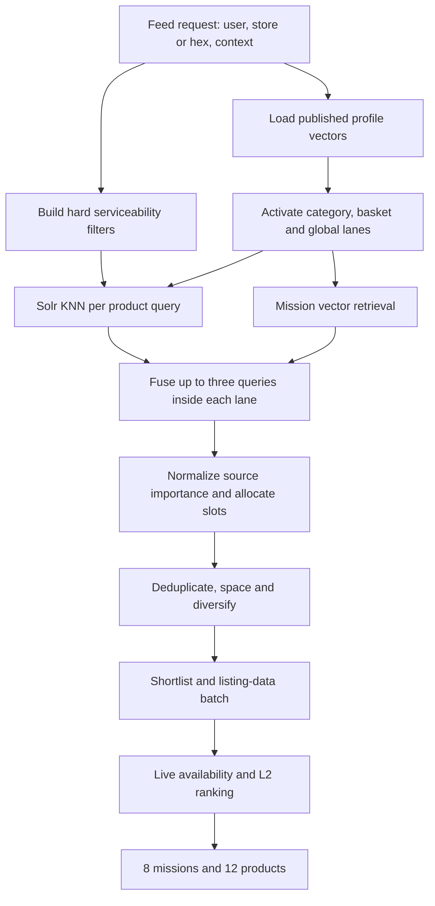

# Minutes Feed Generation Handoff

**Status:** Current serving contract for implementation.

## 1. Purpose

This document defines how the current user profiles power the Minutes feed. It
covers candidate generation, Solr product retrieval, ranking, source
importance, diversity, and load-more session behavior.

The feed exposes two experiences:

```text
POST /api/v1/mission-feed/load
    Returns 8 missions, 12 products, and an internal product pool.

POST /api/v1/mission-feed/mission
    Returns products belonging to one selected mission.
```

Profile generation and embedding happen before serving. The request path does
not call an LLM and does not embed text.

The query-lane, query-fusion, mixing, and diversity rules below describe the
current prototype behavior. The normalized `1.0` source budget replaces its
relative source-importance constants. Commercial-tier boosts and event-aware
load more are the other serving additions defined for implementation here.

## 2. Inputs available at serving time

Each user has three long-term profile sources:

| Profile source | What it represents | Main feed use |
| --- | --- | --- |
| Category profile | Proven preference inside a category | Replenishment, substitutes, preferred product shape |
| Basket profile | Products and categories repeatedly bought together | Basket completion and complements |
| Global profile | Plausible needs beyond direct order repetition | Exploration and category jumps |

Each profile produces separate mission and product **query text**. One lane has
at most three ordered queries:

```json
{
  "source": "category",
  "sourceName": "Milk",
  "missionQueries": [
    { "queryOrder": 0, "text": "Restock familiar toned milk." },
    { "queryOrder": 1, "text": "Buy toned milk in preferred pack sizes." },
    { "queryOrder": 2, "text": "Explore comparable toned milk options." }
  ],
  "productQueries": [
    { "queryOrder": 0, "text": "Amul toned milk 500 ml." },
    { "queryOrder": 1, "text": "Toned milk in 500 ml packs." },
    { "queryOrder": 2, "text": "Toned milk from comparable brands." }
  ]
}
```

The profile does **not** carry an embedding. The recommendation service owns
publication:

```text
profile query text + queryOrder
    -> recommendation publication job
    -> batch embedding
    -> published runtime query record
    -> recommendation feed serving
```

Published runtime query record:

```json
{
  "source": "user_category",
  "sourceName": "Milk",
  "target": "product",
  "queryOrder": 0,
  "text": "Amul toned milk 500 ml.",
  "embedding": [],
  "embeddingModel": "bge",
  "embeddingVersion": "v1",
  "indexVersion": "minutes-products-v1"
}
```

The publisher rejects a vector whose model, dimension, or index version is not
compatible with the active product/mission semantic index. Feed serving reads
only these published records; it never embeds profile text synchronously.

Category and basket profiles can also publish a daypart and weekday/weekend
variant. When one matches the request, it is activated alongside the base
profile. The global profile stays daypart-independent.

The published global runtime profile also carries soft commercial
preferences:

```json
{
  "commercialPreferences": {
    "brandTier": "mass_premium",
    "priceTier": "mid",
    "categoryOverrides": {
      "Milk": {
        "brandTier": "mass_premium",
        "priceTier": "mid"
      }
    }
  }
}
```

Brand and price tiers are structured retrieval signals, not embedding text.
They are computed offline from catalog-resolved order history and joined to the
global profile during publication; they do not change the global LLM output.
Category-specific values override the global value. The serving service does
not ask the LLM to infer current price.

## 3. End-to-end flow



Missions and products are generated independently. A homepage product does not
have to belong to one of the eight returned missions.

## 4. Query lanes

A lane is one profile source and source name, for example:

```text
category:Milk:product
category:Milk:mission
basket:base:product
global:base:mission
session:active:product
```

Product scope is applied before vector search:

| Lane | Product scope |
| --- | --- |
| Category | The category represented by the profile |
| Basket | Cross-category; intended for complements |
| Global | Target category when published, otherwise cross-category |
| Session add-to-cart | Products completing an inferred mission |
| Session PPV | Same analytical type/category as the viewed product |
| Selected mission | Products belonging to that mission |

Mission queries use the resident mission vector index. The mission catalog is
small enough to score in memory. Product queries use Solr because the
serviceable product universe is much larger and changes by store or hex.

## 5. Solr product retrieval

### 5.1 Hard prefilters

Every KNN query applies the same request-level eligibility and its lane scope:

```text
active product
AND serviceable for the request's store/hex
AND allowed by policy
AND lane category/target scope, when present
AND NOT already exposed, purchased, or in cart
```

These are graph prefilters, not post-retrieval filters. Solr searches only the
eligible vector subset and returns the top candidates. The feed service never
loads the full serviceable set of 100,000 products into request memory.

Conceptual Solr request shape:

```text
MUST    KNN(product_vector, query_vector, topK=150)
FILTER  active=true
FILTER  serviceable for store/hex
FILTER  allowed by policy
FILTER  lane category/target scope
FILTER  productId NOT IN session/exposure exclusions
SHOULD  brandTier = preferred brand tier
SHOULD  priceTier = preferred price tier
RETURN  productId, vector score, total score, category, analytical type,
        family, brand, brand tier, price tier, mission IDs
```

Because KNN is combined with other clauses, the KNN parser must receive the
hard filters as explicit graph prefilters. The KNN clause remains mandatory;
the tier clauses cannot admit products outside its semantic top-K.

### 5.2 One retrieval per query

For each active product lane:

1. Deduplicate identical query text and vectors with cosine similarity above
   `0.95`.
2. Execute up to three KNN queries in parallel.
3. Request `topK = 150` from each query.
4. Union candidates by product ID.
5. Keep a lane queue of at most 200 products.

The result queues are deliberately larger than the final page. Diversity,
availability drops, and later pages are filled from these queues without
calling Solr again.

### 5.3 Score decision

Product and query vectors are unit-normalized offline. Configure the Solr
vector field with `dot_product`; for unit vectors this is cosine similarity.
Use the vector score returned by Solr directly as the semantic score and the
total score returned by Solr as the retrieval score.

Do not perform request-time min-max normalization. The range would depend on
the current top-K set and would make the same product score differently as
serviceability changes. Do not fetch a candidate and recompute its cosine in
the feed service; that repeats work Solr has already completed.

If the existing Solr field uses `cosine`, use its returned normalized score
consistently. Do not mix `cosine` and `dot_product` scores within one index
version.

Raw scores are compared only inside the same lane. Candidate scores from a
category lane and a global lane are not globally sorted against each other.
Source importance and slot allocation combine those lanes.

### 5.4 Brand-tier and price-tier should clauses

The following signals are soft boosts, never hard filters:

```text
preferred brand tier match    +0.03
preferred price tier match    +0.05
```

Solr applies them as `should` clauses to the mandatory semantic KNN set. A
non-matching product remains eligible. This keeps semantic relevance primary,
supports the user's usual commercial range, and still permits alternatives and
offers. The total retrieval score is:

```text
retrievalScore = vectorScore
               + 0.03 when brand tier matches
               + 0.05 when price tier matches
```

Price and brand tier must not expand an unrelated semantic result. They only
reorder candidates already admitted by the vector query and hard lane scope.

## 6. Combining the three queries inside a lane

Query order has fixed, deterministic weight:

```text
queryWeight(q) = 0.88 ^ queryOrder

q0 = 1.0000
q1 = 0.8800
q2 = 0.7744
```

For one candidate:

```text
contribution(q, candidate) = retrievalScore(q, candidate) * queryWeight(q)

laneScore = strongest contribution
          + 0.18 * second contribution
          + 0.08 * third contribution
```

The strongest query controls ranking. The second and third queries confirm the
match without allowing three similar phrasings to triple the score.

Example:

```text
q0 contribution = 0.950
q1 contribution = 0.801
q2 contribution = 0.681

laneScore = 0.950 + 0.18(0.801) + 0.08(0.681) = 1.149
```

## 7. Source importance and slot allocation

Candidate-generator importance is an explicit budget. Across every active
source it must sum to exactly `1.0`.

This normalization applies to source and lane importance only. Product and
mission relevance scores are not probabilities and must not be normalized to
sum to one. Candidate-set normalization would make a product's score change
whenever an unrelated product entered or left the top-K.

The starting homepage budget is shared by mission and product generation:

| Source | Base importance |
| --- | ---: |
| Category | 0.60 |
| Basket | 0.25 |
| Global | 0.15 |
| **Total** | **1.00** |

Category receives the majority because it represents demonstrated preference.
Basket preserves meaningful completion and complement behavior. Global keeps a
controlled exploration share. These values are versioned configuration and
can be tuned offline, but one published version always sums to `1.0`.

If a configured source has no valid queue, remove it and renormalize the
remaining source budgets:

```text
activeSourceImportance(s) = configuredImportance(s)
                          / sum(configuredImportance of non-empty sources)
```

If several lanes exist inside one source, split only that source's budget using
lane quality:

```text
laneQuality = max(0.05, top lane semantic score)
effectiveLaneImportance = activeSourceImportance
                        * laneQuality / total quality within source
```

This gives two invariants:

```text
sum(effective lane importance inside source) = active source importance
sum(effective importance across all active lanes) = 1.0
```

Slots are allocated using largest remainder:

```text
idealSlots = pageSize * effectiveLaneImportance
baseSlots  = floor(idealSlots)
remaining slots go to the largest fractional remainders
```

Example for 12 product slots:

```text
category 0.60 -> 7.20 -> 7 slots
basket   0.25 -> 3.00 -> 3 slots
global   0.15 -> 1.80 -> 2 slots after largest remainder
total                         12 slots
```

Candidates are then drawn using weighted fair interleaving. A candidate found
in multiple lanes is emitted once and retains all supporting-lane attribution;
its scores are not added across sources.

If a lane cannot fill its slots after deduplication or diversity, its unused
capacity is released to the remaining lanes. The mixer consumes already
retrieved queues; it does not re-query Solr to fill each dropped item.

## 8. Diversity

Diversity runs during lane queue construction and again after lane mixing.

Products:

- deduplicate exact product IDs and normalized names;
- keep one product per semantic family in the first pass;
- keep one product per brand in the first pass and at most two during backfill;
- space categories so one broad category cannot occupy the page;
- reject near-duplicate product vectors above cosine `0.91`;
- relax one boundary at a time for backfill, while preserving relevance order.

Missions:

- deduplicate mission IDs;
- keep one mission per family in the first pass;
- reject near-duplicate mission vectors above cosine `0.94`;
- suppress a narrow mission when its membership is mostly contained in a
  stronger, broader mission.

Deferred candidates remain in their original lane queue. Diversity does not
trigger a new retrieval.

## 9. Listing data and final ranking

Semantic retrieval should produce a candidate pool before expensive listing
calls:

```text
lane queues -> mixed pool of about 200 products
            -> semantic/diversity shortlist of 60-120
            -> one batched listing request
            -> availability and policy removal
            -> L2 ranking
            -> 12 products
```

L2 can use current price, offer, stock confidence, semantic score, source
attribution, commercial-tier match, and session relevance. Hard availability
always wins over soft preferences. Allow at most one additional listing batch
if the first shortlist loses too many products; do not repeatedly refill one
product at a time.

## 10. Load more and session events

Load more reuses the original request state and adds events observed after the
previous page:

```json
{
  "parentRequestId": "REQ-901",
  "pageToken": "opaque-token",
  "sessionEvents": [
    {
      "eventType": "add_to_cart",
      "productId": "P90210",
      "timestamp": "2026-08-10T18:32:00+05:30"
    }
  ]
}
```

The stored request state contains:

- remaining candidate queues per lane;
- exposed product and mission IDs;
- purchased and in-cart product IDs;
- session event watermark;
- active profile and semantic-index versions;
- page number and expiry.

State expires after 30 minutes. Load more never repeats an exposed product or
mission.

### 10.1 Purchase

```text
Action: suppress the exact purchased product for the session.
Lane:   none.
```

A purchase means the exact need is complete. It does not suppress the whole
category and does not create another recommendation query.

### 10.2 Add to cart

```text
Action: suppress the exact in-cart product and create a basket-completion lane.
Intent: complete the mission around the carted product.
```

Mission inference is deterministic and uses existing vectors:

1. Read missions containing the carted product.
2. Score those missions using the stored product vector against mission
   vectors.
3. Use the active user mission lanes as a bounded tie-breaker.
4. Keep the strongest inferred mission or mission family.
5. Retrieve complementary products inside that mission, excluding the carted
   product and its analytical type when appropriate.

No LLM and no new embedding call is required. Mission membership grounds the
inference; the user profile helps choose between valid missions but does not
invent an unrelated mission.

### 10.3 Product page view

```text
Action: create a comparison lane and suppress the exact viewed product on the
        next page.
Intent: show similar products with meaningful alternatives.
```

The viewed product's stored vector becomes the session query. Solr applies:

```text
same analytical type when available, otherwise same category
AND different product ID
SHOULD different brand
SHOULD different pack size
SHOULD adjacent price tier
```

This produces comparable options instead of unrelated products that happen to
share a broad category.

### 10.4 Importance recomputation

Session events add one session source, not one unlimited source per event.
Multiple active events are fused inside `session:active` using event strength
and recency.

The session receives a bounded part of the total `1.0` budget:

| Strongest actionable state | Session budget |
| --- | ---: |
| Purchase only | 0.00 |
| PPV only | 0.15 |
| Add to cart | 0.25 |
| Add to cart plus PPV | 0.30 maximum |

The long-term sources retain their base ratio inside the remaining budget:

```text
remainingBaseBudget = 1.0 - sessionBudget

category = 0.60 * remainingBaseBudget
basket   = 0.25 * remainingBaseBudget
global   = 0.15 * remainingBaseBudget
session  = sessionBudget
```

Example with add-to-cart:

```text
sessionBudget = 0.25

category = 0.60 * 0.75 = 0.4500
basket   = 0.25 * 0.75 = 0.1875
global   = 0.15 * 0.75 = 0.1125
session                  = 0.2500
total                    = 1.0000
```

Purchase-only activity does not create a session lane, so it does not alter
source allocation. It only updates exclusions.

When several session anchors are active, split the one session budget rather
than adding more total importance:

```text
eventWeight = eventStrength * 0.5 ^ (ageMinutes / 15)

add_to_cart strength = 1.00
PPV strength         = 0.60

sessionLaneImportance = sessionBudget
                      * eventWeight / sum(active event weights)
```

If every session lane is empty after filtering, remove the session source and
restore the base `0.60 / 0.25 / 0.15` budget. Therefore active candidate-source
importance always sums to `1.0`, even when a source becomes unavailable.

The existing category, basket, and global queues are reused. Only a newly
created session lane requires a new Solr query. After that, page slots are
recomputed from the remaining queues and the new normalized importance.

## 11. Mission page

The selected mission is a hard product boundary:

```text
serviceable products
AND selected mission membership
AND session exclusions
```

The selected mission vector is the strongest product lane. Category, basket,
global, and session product lanes can personalize ordering only inside the
mission membership set. They cannot introduce a product from outside the
mission.

The mission page has its own base source budget:

| Product source inside mission | Base importance |
| --- | ---: |
| Selected mission | 0.55 |
| Category | 0.25 |
| Basket | 0.10 |
| Global | 0.10 |
| **Total** | **1.00** |

If session intent is active, take its bounded budget from these four base
sources proportionally using the same `1.0 - sessionBudget` rule. The hard
mission-membership boundary is unchanged.

The same Solr scoring, query fusion, commercial-tier boosts, diversity, and
listing/L2 stages apply. A sparse mission returns fewer products rather than
breaking membership.

## 12. Runtime request contract

Initial feed request:

```json
{
  "userId": "U123",
  "storeIds": ["ST-11", "ST-27"],
  "missionLimit": 8,
  "productLimit": 12,
  "context": {
    "timestamp": "2026-08-10T18:30:00+05:30"
  }
}
```

Response:

```json
{
  "requestId": "REQ-901",
  "missions": [],
  "products": [],
  "nextPageToken": "opaque-token",
  "hasMore": true
}
```

The page token is bound to `requestId`, user, index version, profile version,
page number, and session watermark. Replaying the same token returns the same
page.

## 13. Required diagnostics

For every request, record:

- active source and lane IDs;
- all three query weights and top-K result counts;
- source importance, effective lane importance, and allocated slots;
- top score and score distribution per lane;
- exact deduplication and diversity drops;
- capacity moved between lanes;
- Solr and listing latency;
- session events applied and exclusions created;
- final source, category, brand, and family distribution;
- profile, embedding, semantic-index, and ranking-policy versions.

These diagnostics make weight tuning possible without changing the profile or
API contract.

## 14. Final implementation decisions

1. Query text is embedded offline; serving consumes vectors only.
2. Solr performs serviceability-prefiltered product KNN retrieval.
3. Solr's vector score is used directly inside a lane; no runtime min-max
   normalization or duplicate cosine calculation is performed.
4. Up to three queries are fused with fixed order weights and damped secondary
   support.
5. Category, basket, global, and session remain separate candidate queues.
6. Active candidate-source and lane importance always sums to `1.0` and
   allocates page capacity; individual relevance scores do not sum to one and
   never decide share across sources.
7. Brand tier and price tier are soft should boosts, not eligibility filters.
8. Overfetching and retained queues provide diversity and load-more backfill
   without repeated Solr requests.
9. Purchase suppresses; add-to-cart creates mission-completion intent; PPV
   creates comparison intent.
10. Mission-page membership is always a hard boundary.

Technical basis for dense retrieval and graph prefiltering: [Apache Solr Dense
Vector Search](https://solr.apache.org/guide/solr/latest/query-guide/dense-vector-search.html).
