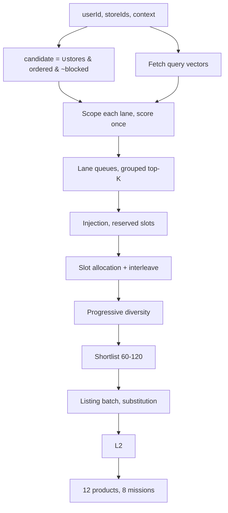

# Minutes Feed — Retrieval and Serving Contract

> **Status: historical design note.** The current serving contract is
> [Minutes Feed Generation Handoff](minutes-feed-generation-handoff.md). Where
> the documents differ, the handoff contract wins, especially for Solr dense
> retrieval, commercial-tier boosts, and load-more session behavior.

## 0. Terms

| Term | Meaning |
| --- | --- |
| Ordinal | A product's dense integer position in the semantic index, `0 … N-1` |
| Bitmap | A bitset over ordinals; bit `i` set = that product qualifies |
| Lane | Queries sharing a source, source name, target, and scope |
| Scope | The ordinal subset a lane may score |
| L2 | Second-stage ranker over live listing data |

## 1. Endpoints

```text
POST /api/v1/mission-feed/load       missions + products, paged
POST /api/v1/mission-feed/mission    products of one mission, paged
```

Runtime only. Profile generation and embedding are offline and out of scope.
All vectors are embedded offline. No text is embedded and no LLM is called at
request time.

| Vectors | Where at request time |
| --- | --- |
| Product, mission | **Resident** — loaded once at startup, never fetched per request |
| User query | Fetched per request, ≤ 614 KB |

Product vectors are a contiguous in-memory matrix indexed by ordinal. The
durable store is a reload source, not a request-path dependency: fetching a
hex's product vectors per request would move ~300 MB per call.

## 2. Ownership

| System | Authoritative for |
| --- | --- |
| Solr | Per-store serviceable bitmaps, catalog eligibility |
| Semantic index | Resident product and mission vectors, ordinals, static attributes |
| Vector store | Durable copy for startup and reload; serves user query vectors |
| Mission catalog | Mission definitions, eligibility, product membership |
| Listing service | Live availability, price, offers |

Solr returns identifiers and bitmaps. Its relevance score is never read.

## 3. Candidate mask

Solr stores a serviceable bitmap per store over the same ordinals as the
semantic index. A request supplies one store or a store list.

```text
serviceable = storeBitmap[s1] | storeBitmap[s2] | …     union: stocked anywhere
candidate   = serviceable & ordered & ~blocked
```

| Bitmap | Meaning | Refresh |
| --- | --- | --- |
| `storeBitmap[s]` | Products the store carries | 60 s |
| `ordered` | `order_score > 0`; static per index version | Index build |
| `blocked` | Policy exclusions, per market and segment | 60 s |

Union across stores, intersection across filters. Intersecting store bitmaps
would yield only products every store carries.

`candidate` is computed once per request as `S+1` bitwise operations for `S`
stores, then reused by every lane. Nothing else touches Solr on the request
path.

```text
Example — user served by ST-11 and ST-27, ordinals 0…6

  storeBitmap[ST-11]   1 0 1 1 0 0 1
  storeBitmap[ST-27]   0 0 1 0 1 0 1
  serviceable   ( | )  1 0 1 1 1 0 1
  ordered       ( & )  1 0 1 1 1 0 0    ordinal 6 has order_score 0
  ~blocked      ( & )  1 0 1 0 1 0 0    ordinal 3 is policy-blocked
  candidate            1 0 1 0 1 0 0  → ordinals 0, 2, 4 are scoreable
```

**Ordinals and versions.** Ordinals are stable within an index version. Every
bitmap and vector set is tagged with its version; a request resolves the active
version once and holds it for its lifetime. A published query vector whose
model, version, or dimension does not match the active index is rejected, not
scored.

Serviceability is slow-moving catalog assignment. Live stock is fast-moving and
handled only at §11.

## 4. Query lanes

| Source | Mission lane admits | Product lane scope |
| --- | --- | --- |
| Category | All feed-eligible | That vertical |
| Basket | All feed-eligible | Unscoped |
| Global | All feed-eligible | Target vertical if published, else unscoped |
| Event | Missions tagged for the active event | Products of missions carrying that tag |
| Season | Missions tagged for the active season | Products of missions carrying that tag |
| Session | All feed-eligible | Unscoped |
| Mission | — | Membership of the requested mission |

Context lanes select missions by tag, and their product scope is the membership
of the missions that matched. Tags are namespaced `<namespace>:<value>`:

| Namespace | Selects |
| --- | --- |
| `season:` | Season lanes; `season:all_season` is unrestricted |
| `daypart:` | Daypart gating; `daypart:anytime` is unrestricted |
| `event:` | Event lanes — **not yet emitted; must be added** |
| `family:` | Diversity family, §10 — **not yet emitted; must be added** |
| `vertical:`, `verticalXtype:` | Grouping keys, §7 |
| `diet:`, `lifestyle:` | Reserved; not used for lane selection |

A mission with no tag in a namespace is unrestricted on that dimension.

Event selection requires a per-event tag identifying *which* event a mission
serves. Mission class alone is insufficient: it marks a mission as event-shaped
but carries no event identity, so it cannot resolve an active event ID to a
mission set.

Published row: `source`, `sourceName`, `target`, `daypart`, `dayType`,
`targetVertical`, `queryOrder`, `text`.

| Property | Value |
| --- | --- |
| Published per user | 70–200 rows |
| Active per request | 30–80 |
| `queryOrder` | 0-based within lane |
| Vectors | Unit normalised; cosine = dot product |
| Text dedup | Lowercase, split non-alphanumeric, join single spaces |
| Event/season lanes | Exist only when the request supplies that context |
| Session lanes | Reuse stored vectors of interacted entities |

Query and document text use one embedding convention, pinned to the index
version.

## 5. Retrieval

```text
scored(lane) = laneScope & candidate
```

Lanes sharing a scope execute as one matrix multiply. Scored bits only; the
mask is applied before scoring, never after.

### 5.1 Diverse selection

Measured on published profiles: a lane's top-10 averages **7.3 of 10 from a
single vertical**, several are 10/10, and 79 product queries covering 11,850
nominal slots collapse to 3,778 distinct products — 3.1× redundancy, with some
query pairs overlapping 100%.

Three rules, all applied during selection:

```text
1. Grouped top-K   take K by score, at most 2 per (vertical, brandKey)
2. Vector dedup    within a lane, drop a query with cosine > 0.95 to one
                   already kept; merge its importance into the kept query
3. Scope widening  later rungs of the exact-to-broad ladder drop the brand
                   constraint, then admit adjacent verticals
```

Rule 3 is required because near-synonyms embed to the same neighbourhood:
"Diet Coke 300 ml" and "zero sugar aerated drinks 300 ml" retrieve identical
sets. Broadening comes from the scope, not the wording.

Unscoped lanes carrying attribute words retrieve across verticals on lexical
overlap — "Zero Sugar" pulls sugar and chewing gum. Scope is the only fix.

### 5.2 Queue depths

| Queue | Depth |
| --- | --- |
| Retrieval depth `K` | 150 per query |
| Product lane | 200 |
| Mission lane | `max(64, missionLimit × 8)` |
| Post-mix pool | ~400 |
| L2 shortlist | 60–120 |
| Page | 12 products, 8 missions |

## 6. Combining lanes

### 6.1 Within a lane

```text
importance(q)      = 0.88 ^ queryOrder          session queries = 1.0
contribution(q,c)  = max(0, cosine(q,c)) × importance(q)
laneScore(c)       = best + 0.18 × second + 0.08 × third      max 1.26
```

```text
Example — Amul Taaza Toned Milk 500 ml scored by a Milk lane

  q0  imp 1.000  cos 0.95  → 0.950   "Amul Taaza pasteurised toned milk 500 ml"
  q1  imp 0.880  cos 0.91  → 0.801   "Amul toned milk 500 ml"
  q2  imp 0.774  cos 0.88  → 0.681   "toned milk 500 ml, other brands"

  laneScore = 0.950 + 0.18(0.801) + 0.08(0.681) = 1.149
```

The rungs of one ladder are near-duplicates, so a product matching all three is
the same evidence three times. Summing would score it 3× a product matched once
strongly; damping lets later matches confirm without multiplying.

### 6.2 Across lanes

Lanes keep separate queues. Slots are allocated, not merged.

```text
laneWeight     = max(0.05, laneTop1Score)
laneImportance = sourceImportance × laneWeight / Σ laneWeight within source
slots(lane)    = pageSize × laneImportance / Σ laneImportance,
                 floored, remainder largest-first
drawOrder      = lowest (selectedCount + 1) / laneImportance
```

`slots` is a hard cap; `drawOrder` only sequences within it. Weights normalise
within a source, so page share matches configured importance regardless of lane
count. All-zero top-1 in a source splits equally via the 0.05 floor.

```text
Example — 12 product slots across 3 lanes

  Milk    imp 0.60   ideal 7.2 → 7
  Bread   imp 0.30   ideal 3.6 → 4     took the leftover on largest remainder
  Global  imp 0.10   ideal 1.2 → 1

  draw order:  Milk Milk Bread Milk Milk Bread Milk Milk Bread Global Milk Bread
```

Allocation runs before ranking because scores are not comparable across
sources: a category lane's best is ~1.15 while a global lane's best is ~0.72,
not because exploration is worse but because broad queries sit further from any
one product. Merging and sorting would give category every slot and silence
exploration permanently.

| Source | Mission | Product |
| --- | --- | --- |
| Category | 1.00 | 1.15 |
| Event | 1.00 | 0.85 |
| Basket | 0.85 | 0.85 |
| Session | 0.82 | 1.00 |
| Season | 0.78 | 0.72 |
| Global | 0.62 | 0.58 |
| Mission | — | 1.30 |

Unlisted sources 0.50. A candidate in two lanes merges attribution; scores
never add. Scores are never compared across sources, so no cross-source
normalisation exists and no query is ever re-issued.

### 6.3 Context floors

An event or season lane is evaluated once on its top-1. Below the floor, the
**whole lane is dropped**.

| Target | Event | Season |
| --- | --- | --- |
| Mission | 0.55 | 0.48 |
| Product | 0.35 | 0.35 |

## 7. Grouping keys

All grouping comes from mission tag namespaces (§4) and product attributes.

| Key | Mission source | Product source |
| --- | --- | --- |
| Family | `family:<f>` tag | — |
| Coarse | `vertical:<v>` tags | `vertical` |
| Fine | `verticalXtype:<v>X<t>` tags | `tag` |

**Family.** Missions carrying the same `family:` tag are the same family; the
family caps in §10 count against that tag. One tag per mission. A mission with
no family tag is its own family and is never suppressed as a family duplicate.

`type` is absent for a large share of the catalog — the fine key then degrades
to coarse and near-duplicate collapse falls back to the similarity cap.

**Brand keys.** One brand name maps to several brand identifiers — "Amul"
resolves to two, and 250 brand strings are ambiguous. A `brandKey` owns a set of
identifiers; a product matches when its identifier is in that set. Keying on a
raw identifier splits one brand across its own catalog.

## 8. Substitution

| Drop cause | Substituted |
| --- | --- |
| Not serviceable | Yes |
| Out of stock at listing | Yes |
| Policy blocked | No |

```text
chain(p) = top 20 q where vertical(q)=vertical(p),
           type(q)=type(p) when present, cosine ≥ 0.80, by cosine desc
```

Walk the chain, take the first bit set in `candidate` and not yet exposed.

| Rule | Value |
| --- | --- |
| Score | dropped score × 0.95 |
| Per dropped candidate | 1 |
| Per page | ≤ 3 |
| Lane and slot | Inherited |
| Cross-vertical | Never |

Empty chain returns one fewer product. Response marks the replaced identifier.

## 9. In-session injection

Each fold after the first reacts to the previous fold's events.

| Strongest event on anchor | Intent | Anchor |
| --- | --- | --- |
| `purchase` | none | Hard suppress, session |
| `add_to_cart` | Complete basket | Suppress — already in cart |
| `product_click`, `product_view` | Compare | Stays eligible |

```text
complements(p) = q sharing ≥1 mission with p, vertical(q) ≠ vertical(p),
                 by (shared mission count, lifetime order count),
                 max 2 per vertical, depth 10
comparators(p) = §8 chain, restricted to differing brandKey, price tier, or
                 pack; chain order preserved
```

```text
Example — anchor Amul Taaza Toned Milk 500 ml (vertical milk, 21 missions)

  shared 9   sugar      UTTAM SUGAR Sulphurfree 1 kg
  shared 7   sugar      DHAMPURE Sulphurless 1 kg
  shared 5   egg        Delish Hen White Eggs 6 Units
  shared 5   fruit      Banana Robusta 4 Units
  shared 4   butter     Amul Pasteurised Salted Butter 100 g
  shared 4   chocolate  Cadbury Dairy Milk 12.1 g
```

The per-vertical cap is required, not optional. Ranked by shared-mission count
alone the top eight are six sugars; the cap is what turns the chain into a
basket.

| Rule | Value |
| --- | --- |
| Reserved slots per fold | 3, at positions 2, 5, 8 |
| Per anchor | 1 injection, once per session |
| Anchor order | Most recent, then event strength |
| Allocation | Outside importance allocation |
| Unfilled slots | Return to normal allocation |

Suppression: purchased product hard-suppressed for the session and its fine key
demoted; coarse vertical is not suppressed. A product taken by injection is
removed from the session lane queue for that fold.

Both chains are precomputed. Injection does no request-time vector work.

## 10. Diversity

Progressive stages. Rejected candidates return to the front of the same queue
for the next, looser stage. Nothing is re-scored.

**Missions** — family cap counts missions sharing a `family:` tag, §7.

| Stage | Family cap | Similarity cap |
| --- | --- | --- |
| Primary | 1 | 0.94 |
| Family backfill | 2 | 0.97 |
| Relevance backfill | 3 | 0.99 |

**Products** — mixer applies a 0.91 near-duplicate cap.

| Stage | Family | Category | Brand |
| --- | --- | --- | --- |
| Primary | 1 | strict | 1 |
| Category spacing | 1 | strict | 1 |
| Brand backfill | 1 | relaxed | 2 |
| Category backfill | 2 | relaxed | 2 |

Feed: relaxed category cap `max(2, ceil(productLimit/6))`, strict
`min(2, relaxed)`, brand cap 2. Mission page: relaxed
`max(2, min(8, ceil(productLimit / max(1, min(6, memberCategoryCount)))))`.

Dedup: identifier + normalised name in lane, identifier + fine key in mixer.
Products with no resolved brand key group by vertical.

Category, brand, and similarity caps are never broken to fill. The family cap
is released in final capacity reallocation.

Mission redundancy = membership-subset ratio. A narrow mission contained by a
broader one is suppressed only when the broader also scores higher.

## 11. Listing and L2

1. Shortlist 60–120 from the pool.
2. One bounded listing batch.
3. Drop unavailable or disallowed; substitute per §8.
4. At most one additional batch.
5. L2, then final diversity.
6. Drop missions left without a preview product.

Batch ≤ 10× page size. Hard availability and policy precede all soft
preference. L2 runs in process over live availability, price and reference
price, offer, approved quality fields, semantic score, contributing sources,
and session relevance. Its formula versions independently.



## 12. API

### 12.1 Feed

```json
{
  "userId": "U123",
  "storeIds": ["ST-11", "ST-27"],
  "missionLimit": 8,
  "productLimit": 12,
  "context": {
    "timestamp": "2026-08-07T18:32:00+05:30",
    "eventIds": ["matchday-2026-08-07"],
    "seasonId": "monsoon-2026"
  }
}
```

```json
{
  "requestId": "REQ-901",
  "missions": [{ "missionId": "M104", "title": "Everyday Milk Restock" }],
  "products": [{
    "productId": "P90210",
    "missionIds": ["M104"],
    "substitutedFor": null,
    "listing": { "available": true, "price": 29, "offerText": null }
  }],
  "nextPageToken": "opaque-token",
  "hasMore": true
}
```

| Field | Type | Notes |
| --- | --- | --- |
| `storeIds` | string[] | Stores serving the user; bitmaps union |
| `missionLimit` / `productLimit` | int | Default 8 / 12; maximums, not fill targets |
| `products[].missionIds` | string[] | Intersection with returned missions; **may be empty** |
| `substitutedFor` | string \| null | Identifier replaced per §8 |
| `nextPageToken` | string \| null | Returned as `pageToken`; null when `hasMore` false |
| `hasMore` | bool | Unexposed candidates remain in lane queues |

Missions and products are independent lists from separate lanes. A product need
not belong to a returned mission.

Daypart from `context.timestamp` in store-local time:

| Daypart | Hours |
| --- | --- |
| morning | 05:00–10:59 |
| afternoon | 11:00–15:59 |
| evening | 16:00–20:59 |
| night | 21:00–04:59 |

`dayType` = `weekend` on Sat/Sun, else `weekday`. No holiday calendar.

**Load more** adds `parentRequestId`, `pageToken`, `sessionEvents[]` of
`{eventType, entityId, timestamp}`.

| `eventType` | Session strength | Injection |
| --- | --- | --- |
| `purchase` | — | Suppress |
| `add_to_cart` | 1.00 | Complete |
| `mission_open` | 0.70 | none |
| `product_click` | 0.60 | Compare |
| `product_view` | 0.35 | Compare |

Contribution `strength × 0.5 ^ (ageMinutes / 15)`; session vector unit
normalised. Token holds exposed identifiers, index version, and session
watermark under `parentRequestId`, TTL 30 min. Replay returns the cached page
and ignores newer events. Exposed products never repeat; missions may.

### 12.2 Mission

Request adds `missionId`, `productLimit` default 24. Response carries one
`mission` and products without `missionIds`. Token bound to `missionId`.

```text
membership & candidate
  → mission lane (mission document as query) + user product lanes + session
  → allocation, diversity → listing → L2
```

Mission is a hard boundary. Sparse missions return fewer products. A mission
ineligible for base context may open directly if it clears §6.3 floors.

### 12.3 Errors

Body `{"errorCode","message"}`.

| Status | Code |
| --- | --- |
| 400 | `INVALID_REQUEST`, `INVALID_PAGE_TOKEN` |
| 404 | `USER_NOT_FOUND`, `MISSION_NOT_FOUND` |
| 409 | `MISSION_NOT_ELIGIBLE` |
| 503 | `SERVICEABILITY_UNAVAILABLE`, `INDEX_UNAVAILABLE` |

Fail closed = 503, never 200 with an empty list.
