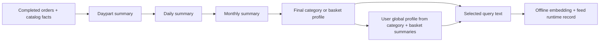

# Minutes User and Location Profile Delivery Plan

## 1. Purpose

This is the profile-generation plan that supports the Minutes feed contract.
It defines only the LLM inputs and outputs, the profile families we will
produce, and the small set of text fields that will later be embedded for feed
retrieval.

The inference service is a pass-through to a Minutes Agent task. It does not
derive fields, store profiles, or call an embedding endpoint. The caller owns
grouping, scheduling, persistence, and publishing.



## 2. Non-negotiable boundaries

- The Minutes time unit is a **daypart**: `morning`, `afternoon`, `evening`,
  or `night`. It is always paired with caller-provided `day_type`:
  `weekday` or `weekend`.
- LLM requests contain no user ID, location ID, physical storage key, raw
  timestamp, calendar date, month, embedding, vector version, or runtime
  ranking field.
- Daily and monthly are caller-owned grouping windows. The LLM sees the
  summaries in the window, not its calendar label.
- LLM responses contain only concise summary text and retrieval-query text.
  They do not contain confidence, uncertainty, evidence bookkeeping, IDs, or
  embeddings.
- Product facts are catalog-resolved before the LLM call. The LLM never tries
  to infer a brand, pack, tier, or commercial class from the name.
- Only final mission and product query strings are embedded. Intermediate
  summaries are retained for the waterfall but are not embedded.

### 2.1 Existing task migration

The existing `user_hourly_summary` / `user_aggregate_summary` path is not a
Minutes feed-profile contract. It is interaction-oriented, uses an hour, and
does not preserve Minutes category, daypart, brand, pack, quantity, or
commercial facts. The implementation will retire it from this profile flow in
favour of `user_category_daypart_summary` and the daypart-to-daily-to-monthly
waterfall defined here.

The registry currently contains an older generic `user_category_profile` task
as well as the feed-waterfall `user_category_preference_profile` task. The
implementation keeps the latter as the canonical waterfall endpoint in
Section 4.3. The older generic task is not part of the feed profile flow and
must remain explicitly legacy if it stays callable.

## 3. Profile families

| Scope | Profile | Final shape | Feed runtime record |
| --- | --- | --- | --- |
| User | Category | Base summary/queries plus repeated daypart/day-type summaries and queries for every category | `userId_category` |
| User | Basket | Base summary/queries plus repeated daypart/day-type summaries and queries | `userId_basket` |
| User | Global | One cross-category summary, commercial preference fields, and base queries | `userId_global` |
| Location / hex | Category | Same shape as user category, based on collective demand in that location | `locationId_category` |
| Location / hex | Global | One cross-category location summary, commercial preference fields, and base queries | `locationId_global` |

There is no location basket profile. Event and in-session records remain
independent feed candidate sources; they are not generated by these
waterfalls.

## 4. Common category waterfall

```text
Catalog-enriched category events in one daypart
    -> daypart category summary
    -> daily category summary
    -> monthly category summary
    -> final category profile
```

The final profile receives recent daypart summaries, recent daily summaries,
and monthly summaries together. This keeps fresh daypart behaviour visible
while allowing repeated monthly evidence to establish the base profile.

### 4.1 Revised user daypart-category request

This replaces the current verbose user "hourly" contract. The task name may
remain `user_category_daypart_summary`, but it must not expose or reason about
an hour.

```json
{
  "category": "Milk",
  "daypart": "afternoon",
  "day_type": "weekday",
  "products": [
    {
      "product_name": "Amul Taaza Pasteurised Toned Milk 500 ml",
      "brand": "Amul",
      "type": "Toned Milk",
      "brand_category": "national",
      "brand_tier": "mass_premium",
      "price_tier": "mid",
      "pack_size": "500 ml",
      "ordered_quantity": 2,
      "product_description": "Pasteurised toned milk in a 500 ml pouch."
    }
  ]
}
```

`ordered_quantity` is the total units for the product in the caller's
daypart window. The caller may collapse repeated identical product lines before
this call. `brand_category` is the catalog commercial class, such as
`national`, `d2c`, `cheap`, or `local`; it is not the brand name.

Output:

```json
{
  "summary_text": "In this weekday-afternoon Milk window, the user bought two 500 ml packs of Amul Taaza toned milk. Commercial preference: brand_category=national; brand_tier=mass_premium; price_tier=mid"
}
```

The summary must preserve demonstrated product, brand, type, pack, quantity,
daypart, and day-type facts whenever supplied. It must not claim a preference
from one observation. The same `summary_text` ends with the labelled
commercial preference clause throughout the category waterfall. A value is
`not_observed` when the source catalog does not provide one unambiguous value.
That clause is metadata, not a semantic retrieval query.

### 4.2 Daily and monthly category contracts

Daily input is the category plus the daypart summaries belonging to one caller
defined local day. Monthly input is the category plus daily summaries belonging
to one caller defined month. Neither contract accepts a date or month value.
Both stages return the one `summary_text`, including the same explicit
commercial preference clause; only supplied commercial facts may be carried
forward.

```json
{
  "category": "Milk",
  "day_type": "weekday",
  "daypart_summaries": [
    {
      "daypart": "afternoon",
      "summary_text": "In this weekday-afternoon Milk window, the user bought two 500 ml packs of Amul Taaza toned milk."
    }
  ]
}
```

```json
{
  "category": "Milk",
  "daily_summaries": [
    {
      "day_type": "weekday",
      "summary_text": "The day's Milk activity included two 500 ml packs of Amul Taaza toned milk in the afternoon."
    }
  ]
}
```

Both responses contain one summary:

```json
{ "summary_text": "... Commercial preference: brand_category=national; brand_tier=mass_premium; price_tier=mid" }
```

### 4.3 Final user-category profile

The final task receives the three summary resolutions. It returns the base
understanding and only those daypart/day-type profiles supported by the input.

```json
{
  "category": "Milk",
  "recent_daypart_summaries": [
    {
      "daypart": "afternoon",
      "day_type": "weekday",
      "summary_text": "The user bought two 500 ml packs of Amul Taaza toned milk. Commercial preference: brand_category=national; brand_tier=mass_premium; price_tier=mid"
    }
  ],
  "recent_daily_summaries": [
    { "day_type": "weekday", "summary_text": "Milk purchases centred on two 500 ml Amul Taaza toned milk packs in the afternoon. Commercial preference: brand_category=national; brand_tier=mass_premium; price_tier=mid" }
  ],
  "monthly_summaries": [
    { "summary_text": "Amul Taaza toned milk in 500 ml packs repeatedly appeared in Milk purchases, often as two units. Commercial preference: brand_category=national; brand_tier=mass_premium; price_tier=mid" }
  ]
}
```

```json
{
  "summary_text": "Milk purchases repeatedly favour Amul Taaza toned milk in 500 ml packs, commonly two units. Commercial preference: brand_category=national; brand_tier=mass_premium; price_tier=mid",
  "mission_queries": [
    "Restock familiar toned milk in practical 500 ml packs."
  ],
  "product_queries": [
    "Amul Taaza pasteurised toned milk in a 500 ml pack.",
    "Amul toned milk in a 500 ml pack.",
    "Toned milk in 500 ml packs from other brands."
  ],
  "daypart_profiles": [
    {
      "daypart": "afternoon",
      "day_type": "weekday",
      "summary_text": "Weekday-afternoon Milk purchases commonly contain two 500 ml packs of Amul Taaza toned milk.",
      "mission_queries": [
        "Restock familiar toned milk during a weekday-afternoon shop."
      ],
      "product_queries": [
        "Amul Taaza toned milk in a 500 ml pack."
      ]
    }
  ]
}
```

The base queries are valid in every request. A daypart profile is published
only when both `daypart` and `day_type` match the feed request.
The commercial preference clause remains inside the one category `summary_text`.

## 5. User basket profile

The basket waterfall keeps complete-order boundaries:

```text
Complete orders in one daypart
    -> daypart basket summary
    -> daily basket summary
    -> monthly basket summary
    -> final basket profile
```

The daypart basket input contains only `daypart`, `day_type`, and complete
catalog-enriched orders. A product in a basket carries the same catalog fields
as the category input where available. The final basket output has the same
compact shape as the final category profile, without `category`:

```json
{
  "summary_text": "The user repeatedly combines toned milk and brown bread in the same basket.",
  "mission_queries": ["Restock familiar milk and bread essentials together."],
  "product_queries": ["Brown bread and closely related bakery staples."],
  "daypart_profiles": [
    {
      "daypart": "evening",
      "day_type": "weekday",
      "summary_text": "Weekday-evening baskets combine toned milk and brown bread.",
      "mission_queries": ["Restock milk and bread in a weekday-evening shop."],
      "product_queries": ["Brown bread for a milk-and-bread essentials basket."]
    }
  ]
}
```

Basket queries describe cross-category combinations and companion spaces. They
must not become another exact-product category profile.

## 6. User global profile

The global profile combines final category profile summaries and the final
basket profile summary. It does not receive a user ID, raw orders, daypart
summaries, product IDs, vectors, or intermediate daily/monthly data.

```json
{
  "category_profiles": [
    {
      "category": "Milk",
      "summary_text": "Milk purchases repeatedly favour Amul Taaza toned milk in 500 ml packs, commonly two units. Commercial preference: brand_category=national; brand_tier=mass_premium; price_tier=mid"
    }
  ],
  "basket_summary_text": "Milk commonly appears with everyday biscuits. Commercial preference: brand_category=national; brand_tier=mass_premium; price_tier=mid"
}
```

```json
{
  "summary_text": "The user shows a repeat-oriented everyday essentials pattern, with a strong practical toned-milk preference.",
  "brand_category": "national",
  "brand_tier": "mass_premium",
  "price_tier": "mid",
  "mission_queries": [
    "Build convenient everyday breakfast essentials beyond familiar milk staples.",
    "Explore simple home beverage and breakfast additions that complement milk buying."
  ],
  "product_queries": [
    "Breakfast cereals, oats, muesli and quick breakfast staples.",
    "Instant coffee, drinking chocolate and home beverage mixes."
  ]
}
```

`summary_text` is the overall user-global semantic description. The commercial
fields are read only from the explicit clauses in the category and basket
summaries: when neither establishes one, it carries `not_observed`, the global
LLM omits that field, and the publisher omits the corresponding runtime boost. The
mission/product query arrays are the only global fields embedded for query
retrieval. The publisher separately embeds `summary_text` into the global
record's single `embedding` field.

The exact policy for how far a global query may jump beyond an observed
category is the next experiment. The record shape above is fixed now, so that
experiment changes prompt policy and evaluation only—not downstream storage or
feed consumption.

## 7. Location profiles

Location profiling uses the same category waterfall and final text shape as
user profiling, but it describes collective demand rather than an individual.
The LLM never receives `locationId` or a hex ID.

### 7.1 Location daypart-category input

```json
{
  "category": "Milk",
  "daypart": "morning",
  "day_type": "weekday",
  "products": [
    {
      "product_name": "Amul Taaza Pasteurised Toned Milk 500 ml",
      "brand": "Amul",
      "type": "Toned Milk",
      "brand_category": "national",
      "brand_tier": "mass_premium",
      "price_tier": "mid",
      "pack_size": "500 ml",
      "ordered_quantity": 185,
      "order_count": 116,
      "buyer_count": 92,
      "product_description": "Pasteurised toned milk in a 500 ml pouch."
    }
  ]
}
```

`ordered_quantity`, `order_count`, and `buyer_count` are caller-computed
aggregates for the location's daypart window. They are intentionally present
only for location data, where aggregate demand must be distinguished from a
single buyer's order.

Output:

```json
{
  "summary_text": "Weekday-morning Milk demand in this location is led by Amul Taaza toned milk in 500 ml packs."
}
```

The daily, monthly, and final location-category contracts match Section 4.
Their language must say "demand in this location" rather than "the user".

### 7.2 Final location-global profile

The input is only final location-category profile text, including supported
daypart text. The output has the same shape as the user-global output:

```json
{
  "summary_text": "This location has a practical everyday-essentials demand pattern led by smaller-pack dairy purchases.",
  "brand_category": "national",
  "brand_tier": "mass_premium",
  "price_tier": "mid",
  "mission_queries": ["Restock everyday breakfast and dairy essentials."],
  "product_queries": ["Toned milk, bread, cereals and quick breakfast staples."]
}
```

There is no location basket input or output.

## 8. Selective embedding and feed publication

The publisher consumes only the following fields:

| Final profile field | Publisher action | Runtime destination |
| --- | --- | --- |
| Category/basket `mission_queries[]` | Embed each string independently | Base `missionEmbeddings` |
| Category/basket daypart `mission_queries[]` | Embed each string independently | Matching `daypartProfiles[].missionEmbeddings` |
| Category/basket `product_queries[]` | Embed each string independently | Base `productEmbeddings` |
| Category/basket daypart `product_queries[]` | Embed each string independently | Matching `daypartProfiles[].productEmbeddings` |
| User/location global `summary_text` | Embed once | Global `embedding` |
| User/location global `mission_queries[]` | Embed each string independently | Global base `missionEmbeddings` |
| User/location global `product_queries[]` | Embed each string independently | Global base `productEmbeddings` |
| User/location global commercial fields | Copy when present | `brandCategory`, `brandTier`, `priceTier` |

The runtime record keys and direct-vector shapes are exactly those in the
Minutes feed contract: `userId_category`, `userId_basket`, `userId_global`,
`locationId_category`, and `locationId_global`. The publisher owns those keys;
they are never exposed to an LLM task.

## 9. Implementation sequence

1. Replace the current verbose category and basket Pydantic models, task
   preparation, prompts, and fixtures with these text-only contracts.
2. Replace the current global task's large behavioral output with the global
   input and output in Section 6.
3. Add the five location tasks: daypart summary, daily summary, monthly
   summary, category profile, and global profile.
4. Add schema and prompt tests for exact product facts, daypart preservation,
   identity-free inputs, no embedding fields, and location wording.
5. Run representative user and location waterfalls, publish only the selected
   fields, and validate the resulting records against the feed contract.
6. Run the category-and-basket-to-global experiment against the fixed global
   shape and evaluate mission/product retrieval quality before changing query
   policy.
