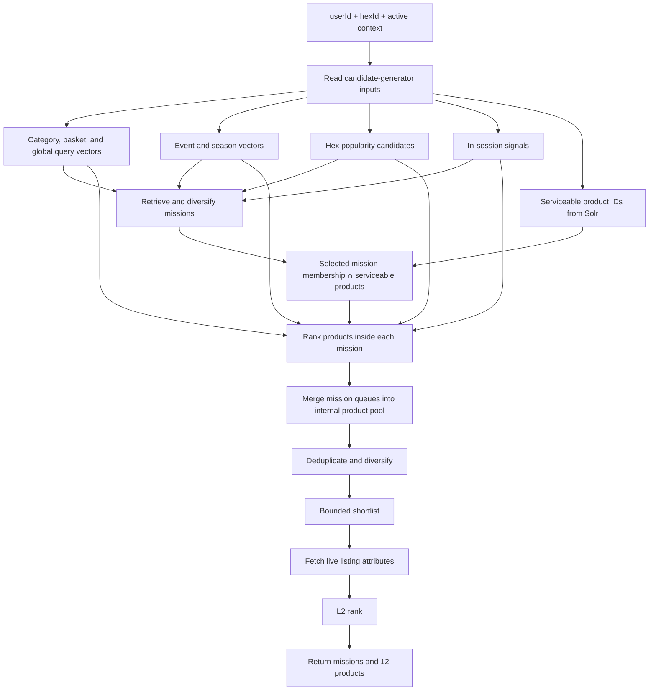

# Minutes User Understanding and Feed Generation (v2)

## 1. Objective and system boundary

Minutes will use completed orders to produce three complementary sources of
personalisation:

- **Category profile:** what the user prefers inside a category, including the
  product, brand, variant, pack size, ordered quantity, and daypart nature.
- **Basket profile:** which products and categories the user repeatedly buys
  together in complete orders.
- **Global exploratory profile:** different but plausible missions and product
  spaces the user may buy next, derived from the final category summaries.

The category and basket profiles describe demonstrated behaviour. The global
profile creates controlled exploration beyond direct repeats and close
substitutes.


The boundaries are strict:

1. The inference endpoint accepts `taskType + inputs`, invokes the matching
   Minutes Agent task, and returns its JSON unchanged.
2. No `userId`, storage key, vector, embedding configuration, or persistence
   metadata enters an LLM request or response.
3. LLM tasks produce text JSON only. They never call an embedding endpoint.
4. A separate offline process embeds only the final query arrays used by feed.
5. The consuming team owns user routing, scheduling, retries, persistence,
   versioning, physical keys, and refresh policy.

Generic inference request:

```json
{
  "taskType": "user_category_daypart_summary_v2",
  "inputs": {}
}
```

The response is exactly the selected task's output.

Task names carrying the `_v2` suffix are new task versions with these smaller
schemas. They are registered as new tasks; an existing task with a similar
name is never changed in place.

## 2. LLM profile contracts

### 2.1 Category waterfall

```text
Category purchase lines within a daypart
    → daypart category summary
    → daily category summary
    → monthly category summary
    → final category profile
```

Daypart means `morning`, `afternoon`, `evening`, or `night`. The consuming team
derives daypart and `weekday`/`weekend` from the local order timestamp before
calling the LLM.

Every category summary must preserve supported product, brand, variant, pack,
quantity, daypart, and day-type facts. A later stage must not restore a detail
that an earlier summary removed, and one purchase must not be described as a
repeated preference.

#### A. Daypart category summary

`taskType`: `user_category_daypart_summary_v2`

Input:

```json
{
  "category": "Milk",
  "daypart": "afternoon",
  "day_type": "weekday",
  "products": [
    {
      "product_name": "Amul Taaza Pasteurised Toned Milk",
      "brand": "Amul",
      "variant": "toned milk",
      "pack_size": "500 ml",
      "ordered_quantity": 2,
      "product_description": "Pasteurised toned milk in a 500 ml pouch."
    }
  ]
}
```

Output:

```json
{
  "summary_text": "In this weekday-afternoon window, the user ordered two units of Amul Taaza Pasteurised Toned Milk in 500 ml packs."
}
```

The caller supplies catalog-resolved fields. The LLM does not infer a brand,
variant, or pack size from an ambiguous product name.

#### B. Daily category summary

`taskType`: `user_category_daily_summary_v2`

Input:

```json
{
  "category": "Milk",
  "date": "2026-07-23",
  "day_type": "weekday",
  "daypart_summaries": [
    {
      "daypart": "afternoon",
      "summary_text": "The user ordered two units of Amul Taaza Pasteurised Toned Milk in 500 ml packs."
    },
    {
      "daypart": "night",
      "summary_text": "The user ordered one unit of Amul Taaza Pasteurised Toned Milk in a 500 ml pack."
    }
  ]
}
```

Output:

```json
{
  "summary_text": "On this weekday, the user bought Amul Taaza Pasteurised Toned Milk in 500 ml packs: two units in the afternoon and one unit at night."
}
```

#### C. Monthly category summary

`taskType`: `user_category_monthly_summary_v2`

Input:

```json
{
  "category": "Milk",
  "month": "2026-07",
  "daily_summaries": [
    {
      "date": "2026-07-03",
      "day_type": "weekday",
      "summary_text": "The user bought two 500 ml units of Amul Taaza Pasteurised Toned Milk in the afternoon."
    },
    {
      "date": "2026-07-12",
      "day_type": "weekend",
      "summary_text": "The user bought two 500 ml units of Amul Taaza Pasteurised Toned Milk at night."
    }
  ]
}
```

Output:

```json
{
  "summary_text": "During July, Amul Taaza Pasteurised Toned Milk in 500 ml packs was repeatedly purchased, usually two units at a time. Purchases occurred on weekdays and weekends across afternoon and night."
}
```

#### D. Final category profile

`taskType`: `user_category_profile_v2`

Input:

```json
{
  "category": "Milk",
  "monthly_summaries": [
    {
      "month": "2026-06",
      "summary_text": "Amul Taaza Pasteurised Toned Milk in 500 ml packs appeared repeatedly, commonly in quantities of two."
    },
    {
      "month": "2026-07",
      "summary_text": "Amul Taaza Pasteurised Toned Milk in 500 ml packs remained the repeated choice across afternoon and night orders."
    }
  ]
}
```

Output:

```json
{
  "summary_text": "In Milk, the strongest repeated preference is Amul Taaza Pasteurised Toned Milk in 500 ml packs, commonly ordered two units at a time.",
  "daypart_nature_text": "The preference appears across afternoon and night rather than being limited to one daypart.",
  "mission_queries": [
    "Restock familiar toned milk in practical small packs."
  ],
  "product_queries": [
    "Amul Taaza pasteurised toned milk in a 500 ml pack.",
    "Amul toned milk in a 500 ml pack.",
    "Toned milk in 500 ml packs from other brands."
  ]
}
```

`product_queries` are ordered from exact demonstrated affinity to safe
broadening. Each query is later embedded independently:

```text
Exact repeated product
    → same brand, variant, and pack
    → same variant and pack from another brand
```

This is the target Milk retrieval behaviour: Amul Taaza toned milk first, other
matching toned milk next, and curd or unrelated Dairy much later. It is a
semantic quality target for the query text, product descriptions, and embedding
model. The runtime exact-repurchase pin (section 4) guarantees placement of the
exact bought product; it does not replace this quality bar.

### 2.2 Basket waterfall

```text
Complete orders within a daypart
    → daypart basket summary
    → daily basket summary
    → monthly basket summary
    → final basket profile
```

Basket inputs preserve complete-order boundaries. Products that happened on
the same day but in different orders are not treated as a basket relationship.

#### A. Daypart basket summary

`taskType`: `user_basket_daypart_summary_v2`

Input:

```json
{
  "daypart": "evening",
  "day_type": "weekday",
  "orders": [
    {
      "products": [
        {
          "product_name": "Amul Taaza Toned Milk",
          "category": "Milk",
          "brand": "Amul",
          "variant": "toned milk",
          "pack_size": "500 ml",
          "ordered_quantity": 2
        },
        {
          "product_name": "Example Bakery Brown Bread",
          "category": "Bread",
          "brand": "Example Bakery",
          "variant": "brown bread",
          "pack_size": "400 g",
          "ordered_quantity": 1
        }
      ]
    }
  ]
}
```

Output:

```json
{
  "summary_text": "This weekday-evening order combined two 500 ml units of Amul Taaza toned milk with one 400 g Example Bakery brown bread."
}
```

#### B. Daily basket summary

`taskType`: `user_basket_daily_summary_v2`

Input:

```json
{
  "date": "2026-07-23",
  "day_type": "weekday",
  "daypart_summaries": [
    {
      "daypart": "evening",
      "summary_text": "The order combined two 500 ml units of Amul Taaza toned milk with one 400 g Example Bakery brown bread."
    }
  ]
}
```

Output:

```json
{
  "summary_text": "The day's basket activity was a focused weekday-evening order combining two 500 ml units of Amul Taaza toned milk with one 400 g Example Bakery brown bread."
}
```

#### C. Monthly basket summary

`taskType`: `user_basket_monthly_summary_v2`

Input:

```json
{
  "month": "2026-07",
  "daily_summaries": [
    {
      "date": "2026-07-05",
      "day_type": "weekend",
      "summary_text": "A weekend-afternoon basket combined two 500 ml units of Amul Taaza toned milk with one 400 g Example Bakery brown bread."
    },
    {
      "date": "2026-07-23",
      "day_type": "weekday",
      "summary_text": "A weekday-evening basket again combined two 500 ml units of Amul Taaza toned milk with one 400 g Example Bakery brown bread."
    }
  ]
}
```

Output:

```json
{
  "summary_text": "Two 500 ml units of Amul Taaza toned milk and one 400 g Example Bakery brown bread repeatedly appeared together during July, across weekend afternoons and weekday evenings."
}
```

#### D. Final basket profile

`taskType`: `user_basket_profile_v2`

Input:

```json
{
  "monthly_summaries": [
    {
      "month": "2026-06",
      "summary_text": "Two 500 ml units of Amul Taaza toned milk and one 400 g Example Bakery brown bread appeared together on multiple afternoon and evening dates."
    },
    {
      "month": "2026-07",
      "summary_text": "The same combination continued across weekend afternoons and weekday evenings."
    }
  ]
}
```

Output:

```json
{
  "summary_text": "The strongest repeated basket relationship is two 500 ml units of Amul Taaza toned milk with one 400 g Example Bakery brown bread.",
  "daypart_nature_text": "The combination occurs across weekend afternoons and weekday evenings.",
  "mission_queries": [
    "Restock familiar milk and bread essentials together."
  ],
  "product_queries": [
    "Example Bakery brown bread in a 400 g pack.",
    "Familiar brown bread and closely related bakery staples."
  ]
}
```

Basket product queries target the companion product space. They do not repeat
the anchor so heavily that retrieval returns more of the already-known anchor.

### 2.3 Global exploratory profile

The global task receives only each category name and its final `summary_text`.
It does not receive `userId`, basket data, raw orders, intermediate summaries,
vectors, catalog IDs, or request context.

`taskType`: `user_global_exploratory_queries`

Input:

```json
{
  "category_summaries": {
    "Milk": "In Milk, the strongest repeated preference is Amul Taaza Pasteurised Toned Milk in 500 ml packs, commonly ordered two units at a time.",
    "Bread": "Brown bread is purchased occasionally, without one stable brand or pack preference."
  }
}
```

Output:

```json
{
  "mission_queries": [
    "Prepare cafe-style hot and cold beverages at home using coffee, cocoa and flavour mixes.",
    "Explore simple homemade desserts using custard, chocolate and dessert mixes.",
    "Build convenient breakfasts using cereals, oats and muesli."
  ],
  "product_queries": [
    "Instant coffee, cocoa powder, drinking chocolate and beverage syrups.",
    "Custard powder, pudding mixes, vermicelli and baking chocolate.",
    "Oats, muesli, breakfast cereals and granola."
  ]
}
```

Global rules:

- The output contains exactly `mission_queries` and `product_queries`.
- Queries are tangential possibilities, not claims about established user
  preferences.
- Queries are not divided by daypart, weekday, or weekend.
- Each string must work independently as an embedding query.
- The LLM may use general product knowledge to make the tangential connection,
  but embedding retrieval resolves the real catalog missions and products.
- The LLM must not invent exact unseen SKUs, prices, offers, availability,
  demographics, household composition, health conditions, or life stage.

### 2.4 Event and season query profile

Events and seasons are context records, not stable user profiles. An
authoritative context provider supplies their name and description.

`taskType`: `context_queries`

Input:

```json
{
  "context_type": "event",
  "context_name": "matchday",
  "context_description": "A live cricket match is active during the shopping window."
}
```

Output:

```json
{
  "mission_queries": [
    "Build a convenient match-viewing snack and beverage spread."
  ],
  "product_queries": [
    "Chips, savoury snacks, soft drinks, juices and quick sharing foods."
  ]
}
```

These queries are embedded offline under the authoritative event or season ID.
The feed never guesses an event from the timestamp alone.

## 3. Offline selective embedding

The LLM waterfall ends with text JSON. It does not call an embedding model and
does not define a persistence layout.

A separate offline publisher embeds only the fields used for retrieval:

| Final output | Embed against missions | Embed against products |
| --- | --- | --- |
| Category profile | `mission_queries[]` | `product_queries[]` |
| Basket profile | `mission_queries[]` | `product_queries[]` |
| Global exploratory profile | `mission_queries[]` | `product_queries[]` |
| Event or season profile | `mission_queries[]` | `product_queries[]` |

The publisher does not embed raw orders, product descriptions, intermediate
summaries, `summary_text`, `daypart_nature_text`, user IDs, dates, or storage
metadata. Every query string is embedded independently; queries are never
concatenated into one profile paragraph.

The publisher preserves only:

- whether the vector targets missions or products;
- whether it came from category, basket, global, event, or season;
- the category or context name when applicable;
- the original array order where that order has meaning.

### Logical view consumed by feed

The consuming team may choose any physical key, record layout, model metadata,
or versioning strategy. A lookup for a user only needs to provide this logical
view to feed:

```json
{
  "category": {
    "Milk": {
      "mission_vectors": [
        [0.021, -0.104, 0.087]
      ],
      "product_vectors": [
        [0.041, -0.063, 0.112],
        [0.038, -0.057, 0.101],
        [0.029, -0.044, 0.094]
      ]
    }
  },
  "basket": {
    "mission_vectors": [
      [0.018, -0.071, 0.066]
    ],
    "product_vectors": [
      [0.031, -0.052, 0.089],
      [0.026, -0.047, 0.083]
    ]
  },
  "global": {
    "mission_vectors": [
      [0.014, -0.036, 0.075],
      [0.011, -0.031, 0.069],
      [0.009, -0.028, 0.064]
    ],
    "product_vectors": [
      [0.017, -0.039, 0.078],
      [0.013, -0.034, 0.072],
      [0.010, -0.029, 0.067]
    ]
  }
}
```

The vectors above are shortened only for readability. In production each entry
contains the complete precomputed vector.

The nesting already identifies the source; no `sourceType`, `sourceName`, or
query ID is needed in this logical view. Array position preserves query order.
For category product queries, earlier positions receive greater importance so
exact-to-broad intent is retained. Basket and global queries are treated as
independent ideas unless their task contract explicitly defines an order.

User association, profile versions, atomic publication, validation, and
physical representation remain owned by the consuming platform. One
consumption requirement applies: the stored record states the embedding model
and version it was built with, and the feed rejects a record that does not
match the active mission and product indexes.

Product and mission descriptions must also be enriched and embedded offline:

- Product text preserves product name, category, brand, variant/form, pack
  size, and factual product purpose.
- Mission text describes the shopping outcome and applicable product families.
- Product and mission vectors use the same compatible embedding space as the
  corresponding query vectors.

## 4. Feed runtime

At runtime, the feed uses only already-computed vectors and catalog signals. It
does not call an LLM or embedding endpoint.



Runtime sequence:

1. Fetch serviceable product IDs for the current hex from Solr.
2. Load the user's stored category, basket, and global query vectors.
3. Load precomputed vectors for active events or seasons.
4. Add hex-level popular mission/product IDs and in-session signals.
5. Search mission vectors, merge the candidate lists using configured query
   importance, and apply mission diversity.
6. For each selected mission, intersect authoritative mission membership with
   Solr serviceability.
7. Rank products inside each selected mission using its product meaning plus
   the relevant category, basket, global, context, location, and session
   signals.
8. Merge the per-mission queues into an internal pool of approximately 200
   unique serviceable products when inventory permits.
9. Deduplicate and diversify, then shortlist before the costly listing call.
10. Batch-fetch current availability, price, offer, and listing attributes only
    for the shortlist; apply L2 ranking and return 12 products.

Every homepage product remains attached to at least one returned mission. The
internal pool of approximately 200 products supports quality and load more; it
is not the number returned to the client.

### Candidate generators and importance

| Source | Purpose |
| --- | --- |
| Category vectors | Familiar missions, exact product intent, and safe close alternatives |
| Basket vectors | Supported basket-completion missions and companion products |
| Global vectors | Tangential mission and product discovery |
| Event/season vectors | Active contextual needs |
| Hex candidates | Products and missions currently strong in the location |
| In-session signals | Adaptation to products and missions viewed, clicked, or added now |

Candidate lists are merged with rank-based fusion: each query contributes by
result rank, weighted by a configured source importance, within a bounded
share per source. Raw similarity scores are never compared across sources, and
no source applies an additive score boost. Category product-query position
preserves exact-to-broad importance. Basket and global queries are not
weakened merely because they appear later in their arrays.

In-session intent is calculated from the already-stored vectors of interacted
products and missions. Unknown entities are skipped. No session action causes
an embedding request.

Three rules are fixed because a prototype run against the full graded mission
catalog showed each one failing without them:

- **Exact-repurchase pin.** The consuming team derives each category's
  repeatedly bought product IDs directly from order history — never from LLM
  text — and the feed pins those serviceable products at the head of their
  category lane. A variant-level or popularity signal alone lets a more
  popular sibling displace the exact bought product.
- **Diversity protects the head.** Mission and product diversity never evict
  the strongest grounded candidates; exploration and context are appended
  after that head. Naive redundancy suppression scores a narrow mission as
  fully redundant against any broader mission that contains it.
- **Bounded context share.** An unbounded event or season boost fills the feed
  regardless of the user. Event, season, and global exploration sources
  compete only within their configured shares.

### Storage and live-data responsibilities

- **Solr:** current coarse serviceability for the user's hex.
- **Aerospike:** durable user-query, mission, and product vector data.
- **Feed memory:** hot mission/product vectors and static metadata. The Minutes
  catalog is small enough for these semantic indexes to be held in memory.
- **Mission catalog:** authoritative mission definitions and product membership.
- **Listing source:** current stock/listing eligibility, price, offers, and
  other dynamic attributes used by L2.

## 5. Feed API behaviour

### 5.1 For You / Home

Endpoint:

```text
POST /api/v1/mission-feed/load
```

Initial request:

```json
{
  "userId": "U123",
  "hexId": "HEX-42",
  "context": {
    "timestamp": "2026-07-23T18:32:00+05:30",
    "eventIds": [
      "matchday-2026-07-23"
    ],
    "seasonId": "monsoon-2026"
  }
}
```

Initial response:

```json
{
  "requestId": "REQ-901",
  "missions": [
    {
      "missionId": "M104",
      "title": "Everyday Milk Restock"
    }
  ],
  "products": [
    {
      "productId": "P90210",
      "missionIds": [
        "M104"
      ],
      "listing": {
        "available": true,
        "price": 29,
        "offerText": null
      }
    }
  ],
  "nextPageToken": "opaque-token",
  "hasMore": true
}
```

The initial response returns 8–12 diversified missions and 12 products when
the eligible catalog supports them.

Load-more request uses the same endpoint:

```json
{
  "userId": "U123",
  "hexId": "HEX-42",
  "parentRequestId": "REQ-901",
  "pageToken": "opaque-token",
  "context": {
    "timestamp": "2026-07-23T18:36:00+05:30"
  },
  "sessionEvents": [
    {
      "eventType": "product_view",
      "entityId": "P7721",
      "timestamp": "2026-07-23T18:35:10+05:30"
    }
  ]
}
```

Load more uses the parent request state, excludes products already shown, and
incorporates the latest in-session activity. Missions may repeat as containers
for new products. Repeating the same page token returns the same page.

### 5.2 Products for one mission

Endpoint:

```text
POST /api/v1/mission-feed/mission
```

Request:

```json
{
  "userId": "U123",
  "hexId": "HEX-42",
  "missionId": "M104",
  "parentRequestId": "REQ-901",
  "pageToken": null,
  "context": {
    "timestamp": "2026-07-23T18:37:00+05:30"
  }
}
```

Response:

```json
{
  "requestId": "REQ-902",
  "mission": {
    "missionId": "M104",
    "title": "Everyday Milk Restock"
  },
  "products": [
    {
      "productId": "P90210",
      "listing": {
        "available": true,
        "price": 29,
        "offerText": null
      }
    }
  ],
  "nextPageToken": "opaque-mission-token",
  "hasMore": true
}
```

The mission is a hard boundary:

```text
Mission membership ∩ Solr serviceability
    → personalised product ranking
    → diversity
    → listing lookup and L2
```

The endpoint never pads with a product outside the selected mission. A sparse
mission returns fewer products. Mission pagination suppresses products already
shown for that mission.

An unknown `missionId` returns `404 MISSION_NOT_FOUND`. A known mission that
is inactive or ineligible for the current event, season, or daypart returns
`409 MISSION_NOT_ELIGIBLE`. A mission page token is valid only for its
`missionId`.

## 6. Failure behaviour

- A missing profile source (category, basket, global, event, season, session)
  is skipped. The feed never generates text or vectors in the request path.
- A user with no stored vectors receives context, hex-popularity, and session
  candidates.
- If the durable vector store is unavailable, the feed serves the newest
  compatible in-memory version and rejects incompatible records.
- If Solr serviceability is unavailable, the feed fails closed rather than
  returning unverified products.
- If the listing source is unavailable, the feed returns fewer products; a
  product is never shown with stale availability or price.
- Diversity shortfalls relax soft spacing only; serviceability, deduplication,
  and mission-membership rules are never relaxed.

## 7. Acceptance criteria

### LLM and profile generation

- No LLM payload contains `userId`, storage metadata, vectors, or embedding
  configuration.
- The inference endpoint returns the agent JSON unchanged.
- Intermediate category and basket tasks return only `summary_text`.
- Category summaries preserve exact product, brand, variant, pack, quantity,
  daypart, and weekday/weekend facts through the waterfall.
- Basket summaries preserve complete-order relationships without inventing the
  user's reason or personality.
- The global task receives only category names and final category summaries.
- The global output contains exactly `mission_queries` and `product_queries`.
- Global queries move into genuinely tangential activities and product spaces.

### Embedding publication

- The profile waterfall performs zero embedding calls.
- Only final mission/product query arrays are embedded.
- Every query is embedded independently.
- Source grouping and meaningful query order are preserved.
- Every stored record states the embedding model and version it was built
  with; the feed rejects records that do not match the active mission and
  product indexes.
- User keys, physical storage, and publication versions remain owned by the
  consuming platform.

### Feed serving

- Initial feed, load more, mission detail, context, and session handling make
  zero embedding-endpoint calls.
- No non-serviceable or unavailable product is returned.
- On the retrieval validation set, the Milk queries must place Amul Taaza toned
  milk ahead of other toned milk, and toned milk ahead of curd or unrelated
  Dairy. Failure means the query text, product enrichment, or embedding model
  must improve before rollout. This validation runs with the exact-repurchase
  pin disabled: the pin is a runtime guarantee, not a substitute for sharp
  queries.
- Fusion is rank-based within bounded source shares; no source applies an
  additive score boost.
- Diversity never removes the strongest grounded missions or products from the
  head of the feed.
- Global exploration appears in a controlled portion of the feed and returns
  different but plausible product spaces.
- Every homepage product belongs to at least one returned mission.
- The internal product pool is approximately 200 when inventory permits, while
  the response contains 12 products.
- Load more does not repeat products and reacts to new session activity.
- Mission detail returns only products belonging to the selected mission.
- Dynamic listing attributes are fetched only after semantic shortlisting.
