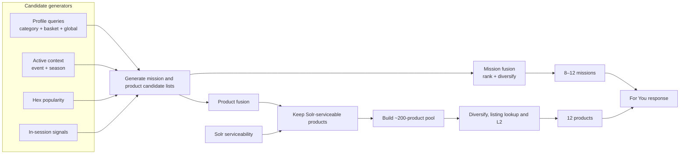

# Minutes User Understanding and Feed Generation

> Implementation note (17 August 2026): the active feed-profile task contracts
> are the compact daypart-to-daily-to-monthly design. This document preserves
> the earlier design and examples; it is not the current agent schema.

## 1. Objective and system boundary

Minutes will use completed orders to produce three complementary sources of
personalisation:

- **Category profile:** what the user prefers inside a category, including the
  product, brand, variant, pack size, ordered quantity, and daypart nature.
- **Basket profile:** which products and categories the user repeatedly buys
  together in complete orders.
- **Global exploratory profile:** different but plausible missions and product
  spaces the user may buy next, derived from the final category summaries.

The category and basket profiles describe demonstrated behaviour. The global
profile creates controlled exploration beyond direct repeats and close
substitutes.


The boundaries are strict:

1. The inference endpoint accepts `taskType + inputs`, invokes the matching
   Minutes Agent task, and returns its JSON unchanged.
2. No `userId`, storage key, vector, embedding configuration, or persistence
   metadata enters an LLM request or response.
3. LLM tasks produce text JSON only. They never call an embedding endpoint.
4. A separate offline process embeds only the final query arrays used by feed.
5. The consuming team owns user routing, scheduling, retries, persistence,
   versioning, physical keys, and refresh policy.

Generic inference request:

```json
{
  "taskType": "user_category_daypart_summary",
  "inputs": {}
}
```

The response is exactly the selected task's output.

## 2. LLM profile contracts

Final category and basket tasks use three overlapping resolutions:

- `recent_daypart_summaries` preserve the freshest exact product, quantity,
  daypart, and weekday/weekend context. They never establish repetition alone.
- `recent_daily_summaries` preserve recent day-level patterns or changes. The
  caller guarantees that every entry represents a different local day.
- `monthly_summaries` establish the stable, repeated behavior that should shape
  the base profile. The caller guarantees that every entry represents a
  different monthly window.

The same orders can appear through all three resolutions. The LLM must not
count a daypart summary, its daily summary, and its monthly summary as three
separate purchases. Arrays are bounded and ordered oldest to newest by the
caller, which also deduplicates each resolution internally. The `recent_`
prefix keeps the fine-grained inputs bounded; it does not add a timestamp.
Literal dates and months remain outside the LLM contract.

### 2.1 Category waterfall

```text
Category purchase lines within a daypart
    → daypart category summary
    → daily category summary
    → monthly category summary

recent daypart + recent daily + monthly summaries
    → final category profile
```

Daypart means `morning`, `afternoon`, `evening`, or `night`. The consuming team
derives daypart and `weekday`/`weekend` from the local order timestamp before
calling the LLM.

Daily and monthly are caller-owned grouping windows, not calendar values the
LLM needs to see. The caller guarantees that one daily request contains one
local calendar day's summaries, one monthly request contains that month's
daily summaries, and all arrays are oldest to newest. The caller retains the
actual date/month for storage, recomputation, and late events; literal `date`
and `month` values are not part of these LLM contracts.

Every category summary must preserve supported product, brand, variant, pack,
quantity, daypart, and day-type facts. A later stage must not restore a detail
that an earlier summary removed, and one purchase must not be described as a
repeated preference.

#### A. Daypart category summary

`taskType`: `user_category_daypart_summary`

Input:

```json
{
  "category": "Milk",
  "daypart": "afternoon",
  "day_type": "weekday",
  "products": [
    {
      "product_name": "Amul Taaza Pasteurised Toned Milk",
      "brand": "Amul",
      "variant": "toned milk",
      "pack_size": "500 ml",
      "ordered_quantity": 2,
      "product_description": "Pasteurised toned milk in a 500 ml pouch."
    }
  ]
}
```

Output:

```json
{
  "summary_text": "In this weekday-afternoon window, the user ordered two units of Amul Taaza Pasteurised Toned Milk in 500 ml packs."
}
```

The caller supplies catalog-resolved fields. The LLM does not infer a brand,
variant, or pack size from an ambiguous product name.

#### B. Daily category summary

`taskType`: `user_category_daily_summary`

Input:

```json
{
  "category": "Milk",
  "day_type": "weekday",
  "daypart_summaries": [
    {
      "daypart": "afternoon",
      "summary_text": "The user ordered two units of Amul Taaza Pasteurised Toned Milk in 500 ml packs."
    },
    {
      "daypart": "night",
      "summary_text": "The user ordered one unit of Amul Taaza Pasteurised Toned Milk in a 500 ml pack."
    }
  ]
}
```

Output:

```json
{
  "summary_text": "On this weekday, the user bought Amul Taaza Pasteurised Toned Milk in 500 ml packs: two units in the afternoon and one unit at night."
}
```

#### C. Monthly category summary

`taskType`: `user_category_monthly_summary`

Input:

```json
{
  "category": "Milk",
  "daily_summaries": [
    {
      "day_type": "weekday",
      "summary_text": "The user bought two 500 ml units of Amul Taaza Pasteurised Toned Milk in the afternoon."
    },
    {
      "day_type": "weekend",
      "summary_text": "The user bought one 500 ml unit of Amul Taaza Pasteurised Toned Milk at night."
    }
  ]
}
```

Output:

```json
{
  "summary_text": "Across the monthly window, Amul Taaza Pasteurised Toned Milk in 500 ml packs was repeatedly purchased, usually as two units in weekday afternoons and one unit on weekend nights."
}
```

#### D. Final category profile

`taskType`: `user_category_profile`

Input:

```json
{
  "category": "Milk",
  "recent_daypart_summaries": [
    {
      "daypart": "afternoon",
      "day_type": "weekday",
      "summary_text": "The user ordered two units of Amul Taaza Pasteurised Toned Milk in 500 ml packs."
    },
    {
      "daypart": "night",
      "day_type": "weekend",
      "summary_text": "The user ordered one 500 ml unit of Amul Taaza Pasteurised Toned Milk."
    }
  ],
  "recent_daily_summaries": [
    {
      "day_type": "weekday",
      "summary_text": "The user bought two 500 ml units of Amul Taaza Pasteurised Toned Milk in the afternoon."
    },
    {
      "day_type": "weekend",
      "summary_text": "The user bought one 500 ml unit of Amul Taaza Pasteurised Toned Milk at night."
    }
  ],
  "monthly_summaries": [
    {
      "summary_text": "Across one monthly window, Amul Taaza Pasteurised Toned Milk in 500 ml packs appeared repeatedly, commonly as two units in weekday afternoons and one unit on weekend nights."
    },
    {
      "summary_text": "Across the next monthly window, Amul Taaza Pasteurised Toned Milk in 500 ml packs remained the repeated choice, with two-unit weekday-afternoon and one-unit weekend-night purchases."
    }
  ]
}
```

Monthly summaries are the primary evidence for stable preferences. The same
explicit pattern across two or more distinct recent daily summaries may also
establish a repeated recent behavior. Daypart summaries preserve finer context
and allow the wording to reflect a newer pattern, but never establish
repetition alone. Evidence is never added across the three arrays.

Output:

```json
{
  "summary_text": "In Milk, the strongest repeated preference is Amul Taaza Pasteurised Toned Milk in 500 ml packs, usually two units in weekday afternoons and one unit on weekend nights.",
  "daypart_nature_text": "Weekday-afternoon purchases usually contain two units, while weekend-night purchases usually contain one unit.",
  "mission_queries": [
    "Restock familiar toned milk in practical small packs."
  ],
  "product_queries": [
    "Amul Taaza pasteurised toned milk in a 500 ml pack.",
    "Amul toned milk in a 500 ml pack.",
    "Toned milk in 500 ml packs from other brands."
  ],
  "daypart_profiles": [
    {
      "daypart": "afternoon",
      "day_type": "weekday",
      "summary_text": "Weekday-afternoon Milk purchases usually contain two 500 ml units of Amul Taaza toned milk.",
      "mission_queries": [
        "Replenish familiar toned milk during a weekday afternoon shop."
      ],
      "product_queries": [
        "Amul Taaza pasteurised toned milk in a 500 ml pack."
      ]
    },
    {
      "daypart": "night",
      "day_type": "weekend",
      "summary_text": "Weekend-night Milk purchases usually contain one 500 ml unit of Amul Taaza toned milk.",
      "mission_queries": [
        "Replenish a familiar single milk pack during a weekend-night shop."
      ],
      "product_queries": [
        "Amul Taaza pasteurised toned milk in a 500 ml pack."
      ]
    }
  ]
}
```

`daypart_profiles` contains only repeated, supported contexts. The task does
not create empty morning/evening entries or turn a one-off observation into a
daypart preference. Base queries remain valid across contexts; matching
daypart queries give the feed the user's context-specific understanding.
`product_queries` are ordered from exact demonstrated affinity to safe
broadening. Each query is later embedded independently:

```text
Exact repeated product
    → same brand, variant, and pack
    → same variant and pack from another brand
```

This is the target Milk retrieval behaviour: Amul Taaza toned milk first, other
matching toned milk next, and curd or unrelated Dairy much later. It is a
semantic quality target for the query text, product descriptions, and embedding
model—not a hidden product-ID boost or deterministic catalog rule.

### 2.2 Basket waterfall

```text
Complete orders within a daypart
    → daypart basket summary
    → daily basket summary
    → monthly basket summary

recent daypart + recent daily + monthly summaries
    → final basket profile
```

Basket inputs preserve complete-order boundaries. Products that happened on
the same day but in different orders are not treated as a basket relationship.

#### A. Daypart basket summary

`taskType`: `user_basket_daypart_summary`

Input:

```json
{
  "daypart": "evening",
  "day_type": "weekday",
  "orders": [
    {
      "products": [
        {
          "product_name": "Amul Taaza Toned Milk",
          "category": "Milk",
          "brand": "Amul",
          "variant": "toned milk",
          "pack_size": "500 ml",
          "ordered_quantity": 2
        },
        {
          "product_name": "Example Bakery Brown Bread",
          "category": "Bread",
          "brand": "Example Bakery",
          "variant": "brown bread",
          "pack_size": "400 g",
          "ordered_quantity": 1
        }
      ]
    }
  ]
}
```

Output:

```json
{
  "summary_text": "This weekday-evening order combined two 500 ml units of Amul Taaza toned milk with one 400 g Example Bakery brown bread."
}
```

#### B. Daily basket summary

`taskType`: `user_basket_daily_summary`

Input:

```json
{
  "day_type": "weekday",
  "daypart_summaries": [
    {
      "daypart": "evening",
      "summary_text": "The order combined two 500 ml units of Amul Taaza toned milk with one 400 g Example Bakery brown bread."
    }
  ]
}
```

Output:

```json
{
  "summary_text": "The day's basket activity was a focused weekday-evening order combining two 500 ml units of Amul Taaza toned milk with one 400 g Example Bakery brown bread."
}
```

#### C. Monthly basket summary

`taskType`: `user_basket_monthly_summary`

Input:

```json
{
  "daily_summaries": [
    {
      "day_type": "weekend",
      "summary_text": "A weekend-afternoon basket combined two 500 ml units of Amul Taaza toned milk with one 400 g Example Bakery brown bread."
    },
    {
      "day_type": "weekday",
      "summary_text": "A weekday-evening basket again combined two 500 ml units of Amul Taaza toned milk with one 400 g Example Bakery brown bread."
    }
  ]
}
```

Output:

```json
{
  "summary_text": "Across the monthly window, two 500 ml units of Amul Taaza toned milk and one 400 g Example Bakery brown bread repeatedly appeared together across weekend afternoons and weekday evenings."
}
```

#### D. Final basket profile

`taskType`: `user_basket_profile`

Input:

```json
{
  "recent_daypart_summaries": [
    {
      "daypart": "afternoon",
      "day_type": "weekend",
      "summary_text": "The order combined two 500 ml units of Amul Taaza toned milk with one 400 g Example Bakery brown bread."
    },
    {
      "daypart": "evening",
      "day_type": "weekday",
      "summary_text": "The order combined two 500 ml units of Amul Taaza toned milk with one 400 g Example Bakery brown bread."
    }
  ],
  "recent_daily_summaries": [
    {
      "day_type": "weekend",
      "summary_text": "A weekend-afternoon basket combined two 500 ml units of Amul Taaza toned milk with one 400 g Example Bakery brown bread."
    },
    {
      "day_type": "weekday",
      "summary_text": "A weekday-evening basket again combined two 500 ml units of Amul Taaza toned milk with one 400 g Example Bakery brown bread."
    }
  ],
  "monthly_summaries": [
    {
      "summary_text": "Across one monthly window, two 500 ml units of Amul Taaza toned milk and one 400 g Example Bakery brown bread appeared together repeatedly across weekend afternoons and weekday evenings."
    },
    {
      "summary_text": "Across the next monthly window, the same combination continued across weekend afternoons and weekday evenings."
    }
  ]
}
```

The basket final task applies the same overlap rule: monthly summaries are the
primary evidence for stable co-purchase behavior, the same explicit pattern
across two or more distinct daily summaries can establish a repeated recent
relationship, and daypart summaries supply exact current context without
independently increasing evidence strength.

Output:

```json
{
  "summary_text": "The strongest repeated basket relationship is two 500 ml units of Amul Taaza toned milk with one 400 g Example Bakery brown bread.",
  "daypart_nature_text": "The combination occurs across weekend afternoons and weekday evenings.",
  "mission_queries": [
    "Restock familiar milk and bread essentials together."
  ],
  "product_queries": [
    "Example Bakery brown bread in a 400 g pack.",
    "Familiar brown bread and closely related bakery staples."
  ],
  "daypart_profiles": [
    {
      "daypart": "afternoon",
      "day_type": "weekend",
      "summary_text": "Weekend-afternoon baskets repeatedly combine two 500 ml units of Amul Taaza toned milk with one 400 g Example Bakery brown bread.",
      "mission_queries": [
        "Restock familiar milk and bread essentials during a weekend-afternoon shop."
      ],
      "product_queries": [
        "Example Bakery brown bread in a 400 g pack."
      ]
    },
    {
      "daypart": "evening",
      "day_type": "weekday",
      "summary_text": "Weekday-evening baskets repeatedly combine two 500 ml units of Amul Taaza toned milk with one 400 g Example Bakery brown bread.",
      "mission_queries": [
        "Restock familiar milk and bread essentials during a weekday-evening shop."
      ],
      "product_queries": [
        "Example Bakery brown bread in a 400 g pack."
      ]
    }
  ]
}
```

Basket product queries target the companion product space. They do not repeat
the anchor so heavily that retrieval returns more of the already-known anchor.
Basket `daypart_profiles` follows the same evidence rule as category profiles:
only repeated contexts are emitted.

### 2.3 Global exploratory profile

The global task receives only each category name and its final `summary_text`.
It does not receive `userId`, basket data, raw orders, intermediate summaries,
vectors, catalog IDs, or request context.

`taskType`: `user_global_exploratory_queries`

Input:

```json
{
  "category_summaries": {
    "Milk": "In Milk, the strongest repeated preference is Amul Taaza Pasteurised Toned Milk in 500 ml packs, usually two units in weekday afternoons and one unit on weekend nights.",
    "Bread": "Brown bread is purchased occasionally, without one stable brand or pack preference."
  }
}
```

Output:

```json
{
  "mission_queries": [
    "Prepare cafe-style hot and cold beverages at home using coffee, cocoa and flavour mixes.",
    "Explore simple homemade desserts using custard, chocolate and dessert mixes.",
    "Build convenient breakfasts using cereals, oats and muesli."
  ],
  "product_queries": [
    "Instant coffee, cocoa powder, drinking chocolate and beverage syrups.",
    "Custard powder, pudding mixes, vermicelli and baking chocolate.",
    "Oats, muesli, breakfast cereals and granola."
  ]
}
```

Global rules:

- The output contains exactly `mission_queries` and `product_queries`.
- Queries are tangential possibilities, not claims about established user
  preferences.
- Queries are not divided by daypart, weekday, or weekend.
- Each string must work independently as an embedding query.
- The LLM may use general product knowledge to make the tangential connection,
  but embedding retrieval resolves the real catalog missions and products.
- The LLM must not invent exact unseen SKUs, prices, offers, availability,
  demographics, household composition, health conditions, or life stage.

### 2.4 Event and season query profile

Events and seasons are context records, not stable user profiles. An
authoritative context provider supplies their name and description.

`taskType`: `context_queries`

Input:

```json
{
  "context_type": "event",
  "context_name": "matchday",
  "context_description": "A live cricket match is active during the shopping window."
}
```

Output:

```json
{
  "mission_queries": [
    "Build a convenient match-viewing snack and beverage spread."
  ],
  "product_queries": [
    "Chips, savoury snacks, soft drinks, juices and quick sharing foods."
  ]
}
```

These queries are embedded offline under the authoritative event or season ID.
The feed never guesses an event from the timestamp alone.

## 3. Offline selective embedding

The LLM waterfall ends with text JSON. It does not call an embedding model and
does not define a persistence layout.

A separate offline publisher embeds only the fields used for retrieval:

| Final output | Embed against missions | Embed against products |
| --- | --- | --- |
| Category profile | `mission_queries[]` | `product_queries[]` |
| Category daypart profile | `daypart_profiles[].mission_queries[]` | `daypart_profiles[].product_queries[]` |
| Basket profile | `mission_queries[]` | `product_queries[]` |
| Basket daypart profile | `daypart_profiles[].mission_queries[]` | `daypart_profiles[].product_queries[]` |
| Global exploratory profile | `mission_queries[]` | `product_queries[]` |
| Event or season profile | `mission_queries[]` | `product_queries[]` |

The publisher does not embed raw orders, product descriptions, intermediate
summaries, `summary_text`, `daypart_nature_text`, user IDs, dates, or storage
metadata. Every query string is embedded independently; queries are never
concatenated into one profile paragraph.

The publisher preserves only:

- whether the vector targets missions or products;
- whether it came from category, basket, global, event, or season;
- the category or context name when applicable;
- the `daypart` and `day_type` for a daypart-specific query;
- the original array order where that order has meaning.

### Logical view consumed by feed

The consuming team may choose any physical key, record layout, model metadata,
or versioning strategy. A lookup for a user only needs to provide this logical
view to feed:

```json
{
  "category": {
    "Milk": {
      "base": {
        "mission_vectors": [
          [0.021, -0.104, 0.087]
        ],
        "product_vectors": [
          [0.041, -0.063, 0.112],
          [0.038, -0.057, 0.101],
          [0.029, -0.044, 0.094]
        ]
      },
      "dayparts": {
        "weekday:afternoon": {
          "mission_vectors": [
            [0.024, -0.097, 0.091]
          ],
          "product_vectors": [
            [0.043, -0.061, 0.109]
          ]
        },
        "weekend:night": {
          "mission_vectors": [
            [0.019, -0.083, 0.079]
          ],
          "product_vectors": [
            [0.040, -0.058, 0.104]
          ]
        }
      }
    }
  },
  "basket": {
    "base": {
      "mission_vectors": [
        [0.018, -0.071, 0.066]
      ],
      "product_vectors": [
        [0.031, -0.052, 0.089],
        [0.026, -0.047, 0.083]
      ]
    },
    "dayparts": {
      "weekend:afternoon": {
        "mission_vectors": [
          [0.020, -0.069, 0.071]
        ],
        "product_vectors": [
          [0.033, -0.050, 0.091]
        ]
      },
      "weekday:evening": {
        "mission_vectors": [
          [0.017, -0.065, 0.063]
        ],
        "product_vectors": [
          [0.030, -0.048, 0.086]
        ]
      }
    }
  },
  "global": {
    "mission_vectors": [
      [0.014, -0.036, 0.075],
      [0.011, -0.031, 0.069],
      [0.009, -0.028, 0.064]
    ],
    "product_vectors": [
      [0.017, -0.039, 0.078],
      [0.013, -0.034, 0.072],
      [0.010, -0.029, 0.067]
    ]
  }
}
```

The vectors above are shortened only for readability. In production each entry
contains the complete precomputed vector.

The nesting identifies the source and daypart context; no `sourceType`,
`sourceName`, or query ID is needed. Array position preserves query order. For
category product queries, earlier positions receive greater importance so
exact-to-broad intent is retained. Basket and global queries are treated as
independent ideas unless their task contract explicitly defines an order.

At runtime the feed always uses `base`, then adds the exact
`day_type:daypart` vectors when present. A deployment may also support an
`any:<daypart>` fallback when the profile has repeated daypart behaviour but no
stable weekday/weekend difference. It never mixes vectors from an unrelated
daypart. Global exploratory vectors remain flat and are not partitioned by
daypart.

User association, profile versions, embedding-model compatibility, atomic
publication, validation, and Aerospike representation remain owned by the
consuming platform. They are intentionally not part of the LLM or business
contract.

Product and mission descriptions must also be enriched and embedded offline:

- Product text preserves product name, category, brand, variant/form, pack
  size, and factual product purpose.
- Mission text describes the shopping outcome and applicable product families.
- Product and mission vectors use the same compatible embedding space as the
  corresponding query vectors.

## 4. Feed runtime

At runtime, the feed uses only already-computed vectors and catalog signals. It
does not call an LLM or embedding endpoint.



The diagram shows the mandatory homepage path. Optional candidate sources and
ranking signals are listed below rather than drawn into these independent
lanes.

Runtime sequence:

1. Fetch serviceable product IDs for the current hex from Solr.
2. Load the user's base category/basket vectors, add only the matching current
   daypart vectors, and load the flat global exploratory vectors.
3. Load precomputed vectors for active events or seasons.
4. Add hex-level popular mission/product IDs and in-session signals.
5. Search mission vectors, merge the candidate lists using configured query
   importance, and apply mission diversity.
6. Independently search products using the relevant category, basket, global,
   context, location, and session product signals.
7. Selected-mission membership may add product candidates or a ranking signal,
   but it never limits the homepage product universe.
8. Merge the product candidate lists, filter them by Solr serviceability, and
   build an internal pool of approximately 200 unique products when inventory
   permits.
9. Deduplicate and diversify, then shortlist before the costly listing call.
10. Batch-fetch current availability, price, offer, and listing attributes only
    for the shortlist; apply L2 ranking and return 12 products.

Homepage missions and homepage products are independent ranked outputs. A
product may appear without belonging to any mission returned on that page.
Selected-mission products are only one optional candidate source. The internal
pool of approximately 200 products supports quality and load more; it is not
the number returned to the client.

### Candidate generators and importance

| Source | Purpose |
| --- | --- |
| Category base + matching daypart vectors | Familiar missions, exact product intent, safe alternatives, and the user's current-daypart behaviour |
| Basket base + matching daypart vectors | Supported basket completion and companions for the current daypart |
| Global vectors | Tangential mission and product discovery |
| Event/season vectors | Active contextual needs |
| Hex candidates | Products and missions currently strong in the location |
| In-session signals | Adaptation to products and missions viewed, clicked, or added now |
| Selected-mission membership | Optional product expansion or ranking signal; never a homepage eligibility rule |

Candidate lists are merged using configurable importance by source. Category
product-query position preserves exact-to-broad importance. Basket and global
queries are not weakened merely because they appear later in their arrays.
Global exploration receives a controlled portion of the feed so it adds
discovery without displacing the strongest demonstrated preferences.

In-session intent is calculated from the already-stored vectors of interacted
products and missions. Unknown entities are skipped. No session action causes
an embedding request.

The current request timestamp remains necessary at feed runtime so the service
can resolve the active local daypart and validate session/event timing. This is
separate from the removed historical `date`/`month` fields in LLM profile
requests.

### Storage and live-data responsibilities

- **Solr:** current coarse serviceability for the user's hex.
- **Aerospike:** durable user-query, mission, and product vector data.
- **Feed memory:** hot mission/product vectors and static metadata. The Minutes
  catalog is small enough for these semantic indexes to be held in memory.
- **Mission catalog:** authoritative mission definitions and product membership
  for mission detail, and optionally homepage candidate expansion.
- **Listing source:** current stock/listing eligibility, price, offers, and
  other dynamic attributes used by L2.

## 5. Feed API behaviour

### 5.1 For You / Home

Endpoint:

```text
POST /api/v1/mission-feed/load
```

Initial request:

```json
{
  "userId": "U123",
  "hexId": "HEX-42",
  "context": {
    "timestamp": "2026-07-23T18:32:00+05:30",
    "eventIds": [
      "matchday-2026-07-23"
    ],
    "seasonId": "monsoon-2026"
  }
}
```

Initial response:

```json
{
  "requestId": "REQ-901",
  "missions": [
    {
      "missionId": "M104",
      "title": "Everyday Milk Restock"
    }
  ],
  "products": [
    {
      "productId": "P90210",
      "listing": {
        "available": true,
        "price": 29,
        "offerText": null
      }
    }
  ],
  "nextPageToken": "opaque-token",
  "hasMore": true
}
```

The initial response returns 8–12 diversified missions and 12 products when
the eligible catalog supports them. The two lists are ranked independently;
homepage products do not require an association with a returned mission.

Load-more request uses the same endpoint:

```json
{
  "userId": "U123",
  "hexId": "HEX-42",
  "parentRequestId": "REQ-901",
  "pageToken": "opaque-token",
  "context": {
    "timestamp": "2026-07-23T18:36:00+05:30"
  },
  "sessionEvents": [
    {
      "eventType": "product_view",
      "entityId": "P7721",
      "timestamp": "2026-07-23T18:35:10+05:30"
    }
  ]
}
```

Load more uses the parent request state, excludes products already shown, and
incorporates the latest in-session activity. Mission and product continuations
remain independent, and a product does not need a returned mission container.
Repeating the same page token returns the same page.

### 5.2 Products for one mission

Endpoint:

```text
POST /api/v1/mission-feed/mission
```

Request:

```json
{
  "userId": "U123",
  "hexId": "HEX-42",
  "missionId": "M104",
  "parentRequestId": "REQ-901",
  "pageToken": null,
  "context": {
    "timestamp": "2026-07-23T18:37:00+05:30"
  }
}
```

Response:

```json
{
  "requestId": "REQ-902",
  "mission": {
    "missionId": "M104",
    "title": "Everyday Milk Restock"
  },
  "products": [
    {
      "productId": "P90210",
      "listing": {
        "available": true,
        "price": 29,
        "offerText": null
      }
    }
  ],
  "nextPageToken": "opaque-mission-token",
  "hasMore": true
}
```

The mission is a hard boundary:

```text
Mission membership ∩ Solr serviceability
    → personalised product ranking
    → diversity
    → listing lookup and L2
```

The endpoint never pads with a product outside the selected mission. A sparse
mission returns fewer products. Mission pagination suppresses products already
shown for that mission.

## 6. Acceptance criteria

### LLM and profile generation

- No LLM payload contains `userId`, storage metadata, vectors, or embedding
  configuration.
- The inference endpoint returns the agent JSON unchanged.
- Intermediate category and basket tasks return only `summary_text`.
- Final category and basket tasks receive bounded
  `recent_daypart_summaries`, `recent_daily_summaries`, and
  `monthly_summaries`.
- The three resolutions are overlapping views of the same orders and are never
  added together as independent evidence. A daypart summary cannot establish
  repetition by itself.
- Literal historical `date` and `month` values remain caller-owned and do not
  enter daily, monthly, or final-profile LLM inputs.
- Category summaries preserve exact product, brand, variant, pack, quantity,
  daypart, and weekday/weekend facts through the waterfall.
- Final category and basket profiles emit `daypart_profiles` only for repeated,
  supported contexts; global exploratory output remains flat.
- Basket summaries preserve complete-order relationships without inventing the
  user's reason or personality.
- The global task receives only category names and final category summaries.
- The global output contains exactly `mission_queries` and `product_queries`.
- Global queries move into genuinely tangential activities and product spaces.

### Embedding publication

- The profile waterfall performs zero embedding calls.
- Only final mission/product query arrays are embedded.
- Matching category/basket `daypart_profiles` query arrays are embedded and
  stored with their `daypart` and `day_type` selectors.
- Every query is embedded independently.
- Source grouping and meaningful query order are preserved.
- User keys, physical storage, vector-model metadata, and publication versions
  remain owned by the consuming platform.

### Feed serving

- Initial feed, load more, mission detail, context, and session handling make
  zero embedding-endpoint calls.
- Feed uses base category/basket vectors plus only the current matching
  daypart vectors; it never mixes unrelated dayparts.
- No non-serviceable or unavailable product is returned.
- On the retrieval validation set, the Milk queries must place Amul Taaza toned
  milk ahead of other toned milk, and toned milk ahead of curd or unrelated
  Dairy. Failure means the query text, product enrichment, or embedding model
  must improve before rollout; the profile contract does not add product-ID
  boosts to force the result.
- Global exploration appears in a controlled portion of the feed and returns
  different but plausible product spaces.
- Homepage missions and products are retrieved and ranked independently; a
  homepage product does not need to belong to a returned mission.
- The internal product pool is approximately 200 when inventory permits, while
  the response contains 12 products.
- Load more does not repeat products and reacts to new session activity.
- Mission detail returns only products belonging to the selected mission.
- Dynamic listing attributes are fetched only after semantic shortlisting.
