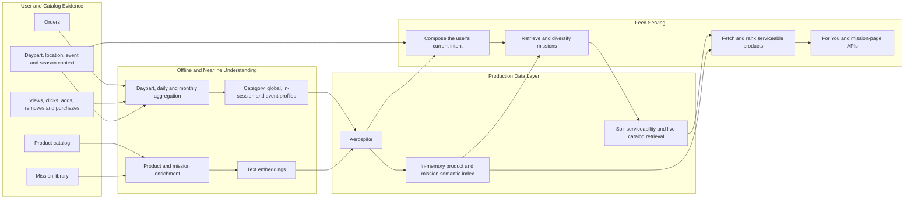
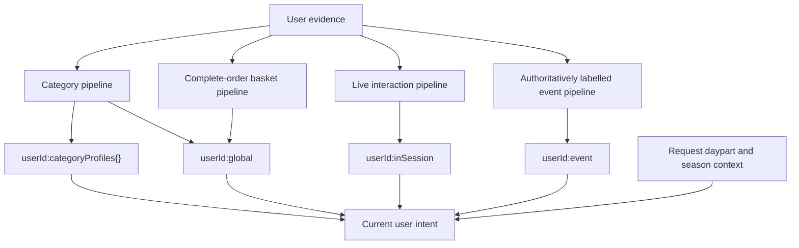
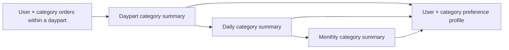
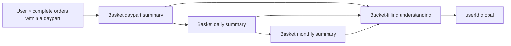
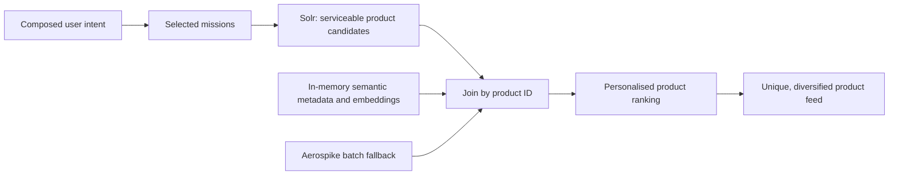
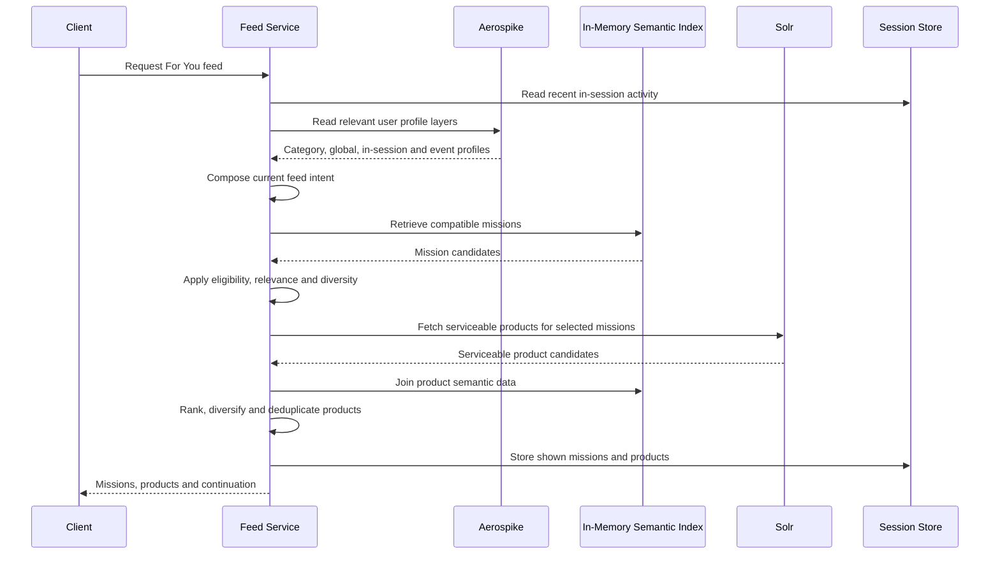
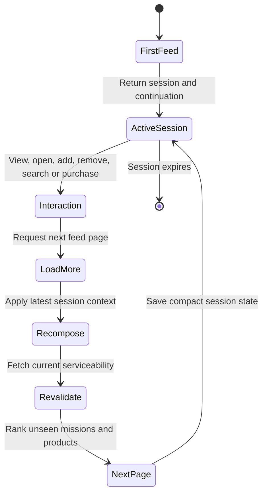

# Minutes Personalisation Platform
## User Profile and Feed Generation Plan

## 1. Executive Overview

Minutes will build a personalisation platform that understands each shopper
across three complementary dimensions:

1. **Category preferences:** what the user prefers within a category, including
   products, brands, variants, pack sizes, quantities, price orientation,
   substitutes, and time-of-day patterns.
2. **Basket or bucket-filling behaviour:** how the user combines products and
   categories into complete orders, which items naturally belong together, and
   what may help complete a basket in a given situation.
3. **Contextual behaviour:** how the user's needs change with daypart,
   in-session activity, events such as matchday or festivals, and seasons such
   as summer or monsoon.

These signals will be represented through natural-language profiles supported
by structured evidence. The natural-language layer allows the recommendation
system to understand relationships that are difficult to express through a
large set of manually maintained rules. The structured layer preserves facts,
confidence, freshness, and operational control.

The profiles will power two feed experiences:

- **For You:** a diversified set of personalised missions and a merged feed of
  up to 200 unique, serviceable products.
- **Mission page:** a personalised product ranking inside one selected mission.

The production system will follow a clear separation of responsibilities:

- Spark and nearline pipelines will convert orders and interactions into
  daypart, daily, and monthly evidence.
- LLM tasks will turn that evidence into grounded, readable user, product, and
  mission understanding.
- Embeddings will make this understanding searchable and comparable.
- Aerospike will provide durable, low-latency profile and semantic data.
- Compact mission and product semantic data will be held in memory by the feed
  service.
- Solr will return the products that are serviceable for the user's location
  at request time.
- Deterministic serving logic will own availability, policy, deduplication,
  diversity, counts, and fallbacks.

The LLM will not sit in the synchronous request path. Feed requests will use
profiles and embeddings that have already been generated, validated, and made
available to the serving system.

## 2. Product Vision

The goal is not simply to predict another product that resembles a previous
purchase. The goal is to understand what the user is likely trying to
accomplish now and build a useful, varied feed around that understanding.

For example, repeated purchases of Amul Taaza Toned Milk 500 ml should teach
the system several different things:

- the user has a supported affinity for toned milk;
- Amul may be a preferred brand within that narrow context;
- 500 ml may be the preferred pack;
- two units may be the normal ordered quantity;
- the purchase may be associated with afternoon or night replenishment;
- bread may be a useful cross-category companion if it repeatedly appears in
  the same basket;
- curd, paneer, cream, and butter should not be treated as equally relevant
  merely because they are also Dairy products.

The system must retain this specificity while still creating room for
substitutes, complements, discovery, and situation-specific missions.

### 2.1 Design principles

1. **Specific evidence beats broad category assumptions.**
2. **Complete-order behaviour is understood separately from category
   preference.**
3. **Fresh behaviour can influence the feed without immediately becoming a
   permanent preference.**
4. **Events and seasons come from authoritative context, not timestamp
   guessing.**
5. **The user is described through evidence, not assigned a fixed personality
   or shopping-mode label.**
6. **LLM text provides meaning; deterministic systems provide control.**
7. **Only serviceable products can be recommended.**
8. **A useful feed requires relevance and diversity together.**
9. **Every profile statement must preserve uncertainty and scope.**
10. **All profile and semantic data must be understandable and auditable by
    internal teams.**

## 3. Production System Overview



The architecture has two operating loops:

- The **understanding loop** continuously improves profiles and semantic
  representations as evidence accumulates.
- The **serving loop** combines those profiles with live context and live
  product serviceability to produce the feed.

## 4. User Profile Architecture

### 4.1 The four serving profile families

The feed service will read only four logical profile families:

| Logical profile | What it represents |
| --- | --- |
| `userId:categoryProfiles{}` | A map of the user's supported preferences within each category, including daypart differences |
| `userId:global` | Stable cross-category understanding, including basket or bucket-filling behaviour |
| `userId:inSession` | Short-lived actions and intent inside the active feed or shopping session |
| `userId:event` | A map of the user's supported behaviour across named, authoritatively identified events |

Daypart, daily, monthly, basket, and season data remain important, but they are
not additional serving profile keys:

- daypart, daily, and monthly summaries are stages used to build category and
  global profiles;
- basket or bucket-filling understanding becomes part of the global profile;
- current session activity is represented by `userId:inSession`;
- season is authoritative request context and can select seasonal evidence
  already contained inside category or global profiles;
- an event receives its own profile only because named event behaviour can be
  materially different from ordinary behaviour and can repeat across
  independent occurrences.



### 4.2 Evidence used to build profiles

Profiles will be built from observable evidence:

- ordered product and product variant;
- category and subcategory;
- brand;
- pack size and unit of measure;
- ordered quantity;
- paid price and available price context where approved;
- order timestamp and daypart;
- weekday or weekend;
- complete basket membership;
- repeated co-purchases;
- product view, mission view, click, add, remove, and purchase signals;
- hub and location context;
- authoritative event and season labels;
- the first and most recent dates on which a behaviour was observed.

The profile system will not infer unsupported demographics, household
composition, health status, life stage, guests, or intent. A profile can say
that milk and bread are repeatedly ordered together; it cannot claim that the
user has a family or is preparing breakfast for children.

### 4.3 Category profile

A category profile answers: **what does this user prefer within this specific
category, and under which conditions?**

Each category profile can contain:

| Dimension | Meaning |
| --- | --- |
| Product affinity | Repeated exact products or tightly related product families |
| Brand affinity | Brands supported within this category and product context |
| Variant and form | Toned, full cream, salted, liquid, powder, fragrance, flavour, or other category-specific distinctions |
| Pack preference | Supported pack size, count, or unit-of-measure preference |
| Ordered quantity | Typical number of units for the supported product or pack |
| Price and value | Repeated value, premium, deal, or price-band behaviour when supported |
| Replenishment | Whether orders show a repeated cadence or gap-filling pattern |
| Daypart pattern | Morning, afternoon, evening, or night behaviour |
| Day-type pattern | Weekday and weekend differences |
| Substitution boundary | Which alternatives appear acceptable and which are too far away |
| Negative or weak evidence | Products repeatedly skipped, removed, or not supported |
| Fresh movement | Recent behaviour that may be strengthening or weakening a preference |
| Confidence and uncertainty | Strength, scope, and limitations of every claim |

Category profiles must remain narrow enough to protect user intent. A
toned-milk affinity is not automatically a Dairy-wide affinity. A brand
preference observed for milk is not automatically a brand preference for curd
or ice cream.

### 4.4 Category profile waterfall

Category understanding begins at the daypart level because morning,
afternoon, evening, and night can represent materially different needs.



- The **daypart summary** describes what happened during the relevant portion
  of the day without over-generalising.
- The **daily summary** combines the day's available daypart summaries while
  preserving their differences.
- The **monthly summary** identifies repetition, stability, change, and
  exceptions across independent dates.
- The **category preference profile** combines fresh detail with stable
  evidence and clearly states boundaries and uncertainty.

The same order can appear in more than one summary level, but it remains one
underlying observation. Confidence must be based on independent evidence, not
on how many times that order was restated during aggregation.

### 4.5 Basket or bucket-filling understanding

The basket pipeline answers: **what does the user assemble as a complete
order, and what relationships exist across categories?**

It captures:

- products and categories repeatedly bought together;
- anchor products that often lead the basket;
- useful complements supported by actual co-purchase evidence;
- basket breadth and total unit patterns;
- daypart and weekday/weekend differences;
- recurring combinations;
- category gaps that may help complete a familiar basket;
- the difference between a narrow replenishment order and a broader order;
- uncertainty when combinations have appeared only once.

The output is descriptive, not a fixed shopper label. We will not create
fields such as `routine_replenishment` or `urgent_problem_solving`. The same
person can show different behaviour at different times, and the profile should
retain that nuance in readable text.

### 4.6 Basket profile waterfall



The system must preserve complete-order boundaries. Flattening every product
across several orders into one list would create false product relationships.

### 4.7 Global profile

`userId:global` represents the user's durable cross-category understanding. It
combines stable category and basket evidence across dayparts and time periods.

It should explain:

- the strongest supported category affinities;
- exact products, brands, variants, packs, and quantities worth preserving;
- reliable cross-category relationships;
- broad value or premium behaviour when it is consistent;
- stable replenishment patterns;
- useful discovery boundaries;
- meaningful differences by daypart;
- meaningful seasonal differences;
- conflicting or changing evidence;
- areas where the system still knows very little.

The global profile is not a personality summary. Its purpose is to provide a
stable recommendation foundation while retaining supported daypart and season
differences inside the profile.

For example, the same global profile can say that morning evidence centres on
milk, bread, and fruit while night evidence more often contains snacks,
beverages, or household gaps. Daypart remains a section of the global
understanding rather than becoming another profile key.

### 4.8 In-session profile

`userId:inSession` represents the user's active intent inside the current feed
or shopping session. It can include:

- missions and products already shown;
- mission opens and product views;
- adds and removals;
- searches;
- purchases;
- newly appearing category interest;
- products and mission families to increase or suppress;
- current hub, location, daypart, event, and season context;
- timestamps and expiry.

The in-session profile changes immediately as actions arrive. It guides load
more and subsequent mission-page ranking but remains temporary. Repeated
evidence can later enter the normal daypart, daily, and monthly aggregation
pipelines; one session does not directly rewrite category or global
preferences.

### 4.9 Event profile

`userId:event` contains the user's event-profile map. Each entry describes how
the user has behaved across independently observed occurrences of one
authoritatively identified event.

Examples include:

- cricket or football matchday;
- festival preparation;
- a sale or campaign window;
- a local celebration;
- another clearly named business event.

An event profile can describe:

- categories and products repeatedly associated with the event;
- basket combinations;
- quantities that differ from normal behaviour;
- preparation timing before the event;
- missions that received engagement;
- the number of distinct event occurrences supporting the behaviour;
- how event behaviour differs from the stable profile.

At serving time, the active event comes from the request context or an
authoritative context service. A timestamp alone must never create a matchday
or festival assumption.

### 4.10 Daypart and season context

Daypart and season affect profile generation and feed composition without
becoming top-level profile keys.

- Category profiles retain morning, afternoon, evening, and night differences
  within each category.
- The global profile retains supported cross-category and basket differences
  by daypart.
- Seasonal observations can be retained inside the relevant category and
  global sections.
- The request supplies the active daypart and authoritative season.
- The service selects and weights only the portions of category and global
  understanding that apply now.

Season examples include summer, monsoon, winter, or another regionally
appropriate period. The system may describe supported seasonal changes in
category, product form, pack, quantity, or basket composition, but it does not
create a separate season-keyed user record.

### 4.11 Confidence, freshness, and conflict resolution

Every meaningful preference statement carries:

- **scope:** the category, product, daypart, event, or season to which it
  applies;
- **confidence:** low, medium, or high;
- **evidence breadth:** independent dates, orders, and labelled occurrences;
- **freshness:** when it was first and last observed;
- **uncertainty:** what the evidence does not establish.

Confidence grows through repeated, consistent evidence across independent
dates. It falls when behaviour is sparse, old, or contradictory.

When profile layers disagree, feed composition follows these rules:

1. Live policy, location, and serviceability constraints always win.
2. Explicit request context determines the active daypart, event, and season.
3. Narrow category evidence is preferred over a broad global statement.
4. In-session evidence adjusts the current ranking but does not erase a
   high-confidence stable preference after one observation.
5. Repeated in-session actions can reshape the active session.
6. Unknowns remain unknown; the system broadens carefully instead of inventing
   an explanation.

## 5. Profile Data Contracts

### 5.1 Category-profiles example

```json
{
  "userId": "USER_ID",
  "profileType": "category_profiles",
  "categoryProfiles": {
    "dairy": {
      "categoryName": "Dairy",
      "summaryText": "The user repeatedly buys toned milk in 500 ml packs, with the strongest evidence in the afternoon.",
      "preferences": {
        "products": [
          {
            "productText": "Amul Taaza Pasteurised Toned Milk 500 ml",
            "preferenceText": "This is the strongest repeated product within the Dairy evidence.",
            "confidence": "high"
          }
        ],
        "brands": [
          {
            "brand": "Amul",
            "preferenceText": "Amul is repeatedly selected for toned milk.",
            "confidence": "high",
            "boundaryText": "This does not establish an Amul preference across all Dairy products."
          }
        ],
        "variants": [
          {
            "variant": "toned milk",
            "preferenceText": "Toned milk is preferred over unrelated Dairy forms.",
            "confidence": "high"
          }
        ],
        "packSizes": [
          {
            "packSize": "500 ml",
            "preferenceText": "The 500 ml pack is repeatedly selected.",
            "confidence": "medium"
          }
        ],
        "orderedQuantities": [
          {
            "quantity": 2,
            "preferenceText": "Two units are commonly ordered for this product and pack.",
            "confidence": "medium"
          }
        ]
      },
      "daypartUnderstanding": [
        {
          "daypart": "afternoon",
          "behaviorText": "Afternoon contains the strongest repeated replenishment evidence.",
          "confidence": "high"
        },
        {
          "daypart": "night",
          "behaviorText": "Night orders reinforce the same product preference with less evidence.",
          "confidence": "medium"
        }
      ],
      "seasonalUnderstanding": [],
      "substitutionText": "Prefer toned-milk alternatives before broadening to other milk forms.",
      "uncertaintyText": "There is insufficient evidence for curd, paneer, butter, cream, or cheese preferences.",
      "evidence": {
        "independentDates": 5,
        "orderCount": 7,
        "firstSeenAt": "TIMESTAMP",
        "lastSeenAt": "TIMESTAMP"
      }
    },
    "bakery": {
      "categoryName": "Bakery",
      "summaryText": "Brown bread has a smaller but repeated relationship with milk baskets.",
      "preferences": {},
      "daypartUnderstanding": [],
      "seasonalUnderstanding": [],
      "substitutionText": "",
      "uncertaintyText": "Evidence is insufficient for a stable brand or pack preference.",
      "evidence": {
        "independentDates": 2,
        "orderCount": 2,
        "firstSeenAt": "TIMESTAMP",
        "lastSeenAt": "TIMESTAMP"
      }
    }
  },
  "updatedAt": "TIMESTAMP"
}
```

### 5.2 Basket profile contract

The basket profile is a required output of the complete-order waterfall. It is
not an additional serving key. It is generated from basket daypart, daily, and
monthly summaries and then consumed when building `userId:global`.

```json
{
  "userId": "USER_ID",
  "artifactType": "basket_profile",
  "summaryText": "The user's strongest repeated basket relationship is toned milk with brown bread, usually inside a small replenishment order.",
  "basketRelationships": [
    {
      "anchorProducts": [
        "Amul Taaza Pasteurised Toned Milk 500 ml"
      ],
      "companionProducts": [
        "Brown bread"
      ],
      "categories": [
        "Dairy",
        "Bakery"
      ],
      "relationshipText": "Milk and brown bread repeatedly occur in the same complete order.",
      "recommendationUseText": "When milk is the active need, brown bread can support a separate breakfast or basket-completion mission.",
      "boundaryText": "The evidence does not make every Bakery product relevant to a milk order.",
      "confidence": "medium",
      "evidence": {
        "independentDates": 3,
        "completeOrderCount": 3,
        "firstSeenAt": "TIMESTAMP",
        "lastSeenAt": "TIMESTAMP"
      }
    }
  ],
  "basketCharacteristics": {
    "breadthText": "Supported orders are usually narrow and contain a small number of categories.",
    "quantityText": "The strongest repeated quantity pattern is two units of the preferred 500 ml milk pack.",
    "valueText": "There is insufficient evidence for a stable value or premium basket preference."
  },
  "daypartUnderstanding": [
    {
      "daypart": "afternoon",
      "behaviorText": "The milk-and-bread relationship is strongest in afternoon orders.",
      "confidence": "medium"
    },
    {
      "daypart": "night",
      "behaviorText": "Night baskets reinforce milk replenishment but provide weaker evidence for bread.",
      "confidence": "low"
    }
  ],
  "dayTypeUnderstanding": [
    {
      "dayType": "weekday",
      "behaviorText": "The repeated relationship is supported on weekdays.",
      "confidence": "medium"
    }
  ],
  "candidateBasketNeeds": [
    {
      "needText": "Complete a familiar milk-and-bread replenishment basket.",
      "supportText": "The need is grounded in repeated complete-order co-occurrence.",
      "confidence": "medium"
    }
  ],
  "uncertaintyText": "The available evidence does not support a fixed shopping mode, household assumption, or broad breakfast preference.",
  "evidence": {
    "independentDates": 5,
    "completeOrderCount": 7,
    "firstSeenAt": "TIMESTAMP",
    "lastSeenAt": "TIMESTAMP"
  },
  "updatedAt": "TIMESTAMP"
}
```

The global-profile task receives this basket profile together with the category
profiles. It preserves supported cross-category relationships, circumstances,
and basket boundaries inside `userId:global`. Live adds and removals are handled
separately by `userId:inSession`.

### 5.3 Global-profile example

```json
{
  "userId": "USER_ID",
  "profileType": "global",
  "summaryText": "The strongest stable evidence is toned-milk replenishment, with a smaller supported connection to brown bread.",
  "categoryUnderstanding": [
    {
      "category": "Dairy",
      "behaviorText": "Toned milk in smaller packs is the strongest afternoon preference.",
      "confidence": "high"
    },
    {
      "category": "Bakery",
      "behaviorText": "Brown bread appears as a repeated companion to milk.",
      "confidence": "medium"
    }
  ],
  "daypartUnderstanding": [
    {
      "daypart": "afternoon",
      "behaviorText": "Milk replenishment is strongest in the afternoon.",
      "confidence": "high"
    },
    {
      "daypart": "night",
      "behaviorText": "Night evidence reinforces milk but remains less frequent.",
      "confidence": "medium"
    }
  ],
  "seasonalUnderstanding": [],
  "basketUnderstanding": [
    {
      "relationshipText": "Milk and brown bread are repeatedly ordered in the same complete basket.",
      "recommendationUseText": "A breakfast or replenishment mission may connect these categories without treating every Bakery product as relevant.",
      "confidence": "medium"
    }
  ],
  "quantityAndValueText": "The strongest supported quantity pattern is two units of the preferred 500 ml milk pack.",
  "uncertaintyText": "The evidence does not support a broad preference across all Dairy or Bakery products.",
  "updatedAt": "TIMESTAMP"
}
```

### 5.4 Event profile example

```json
{
  "userId": "USER_ID",
  "profileType": "event_profiles",
  "eventProfiles": {
    "cricket_matchday": {
      "eventName": "Cricket Matchday",
      "summaryText": "Across repeated labelled matchdays, the user adds cold beverages and savoury snacks more often than in ordinary orders.",
      "categoryBehavior": [
        {
          "category": "Beverages",
          "behaviorText": "Cold beverages become more relevant before the match window.",
          "confidence": "medium"
        },
        {
          "category": "Snacks",
          "behaviorText": "Savoury snacks repeatedly accompany beverages.",
          "confidence": "medium"
        }
      ],
      "basketUnderstandingText": "Beverages and savoury snacks form the strongest supported matchday combination.",
      "differenceFromGlobalText": "This is an event-specific expansion and should not permanently dominate the normal feed.",
      "evidence": {
        "independentEventOccurrences": 3,
        "lastSeenAt": "TIMESTAMP"
      }
    }
  },
  "updatedAt": "TIMESTAMP"
}
```

### 5.5 In-session profile example

```json
{
  "userId": "USER_ID",
  "profileType": "in_session",
  "feedSessionId": "SESSION_ID",
  "intentText": "The user opened a milk-replenishment mission and added toned milk; prioritise complementary needs while suppressing repeated milk variants.",
  "seenMissionIds": [],
  "seenProductIds": [],
  "openedMissionIds": [],
  "addedProductIds": [],
  "removedProductIds": [],
  "activeCategorySignals": [
    {
      "category": "Dairy",
      "behaviorText": "The active session confirms the known toned-milk need.",
      "signal": "strengthen"
    }
  ],
  "activeMissionSignals": [
    {
      "missionText": "Milk replenishment",
      "behaviorText": "The mission has been opened and its anchor need has been satisfied.",
      "signal": "suppress_repetition"
    }
  ],
  "context": {
    "daypart": "afternoon",
    "season": "monsoon",
    "event": null,
    "hubId": "HUB_ID"
  },
  "updatedAt": "TIMESTAMP",
  "expiresAt": "TIMESTAMP"
}
```

The in-session record is primarily constructed from deterministic interaction
events. A compact semantic `intentText` can be produced from those events when
useful, but no online LLM call is required.

### 5.6 What the LLM writes and what the system controls

| Responsibility | Produced by |
| --- | --- |
| Readable summaries, preference descriptions, relationship descriptions, boundaries, and uncertainty | LLM profile tasks |
| User ID, product ID, category, event ID, timestamps, counts, and source data | Data and profile pipelines |
| Confidence acceptance and minimum-evidence rules | Profile validation |
| Embeddings | Embedding service using accepted semantic text |
| Product serviceability, inventory, hub, and location eligibility | Solr and upstream operational systems |
| Mission/product diversity, deduplication, counts, and policy | Feed service |

The LLM will receive readable business evidence. It will not receive internal
cache details, vector values, storage metadata, or pipeline implementation
language. Unsupported text will be rejected before a profile becomes
available to feed serving.

## 6. Product and Mission Understanding

User profiles become useful only when products and missions are described with
the same level of meaning.

### 6.1 Product understanding

Each product will have an enriched semantic record containing:

- grounded product identity;
- category and product form;
- brand, variant, flavour, fragrance, or other relevant attributes;
- pack size and unit of measure;
- possible use cases;
- daypart, event, and season relevance;
- suitable substitutes;
- useful complements;
- decision factors that may matter to a user;
- compatible mission families;
- explicit boundaries describing where the product does not fit;
- one dense semantic description used for retrieval and ranking;
- an embedding generated from the accepted semantic description.

Catalog facts remain grounded in the product source. The enrichment process
must not invent ingredients, nutrition, certifications, health benefits,
packaging, demographics, price, or performance.

### 6.2 Mission understanding

Each mission will have:

- a clear mission identity and user need;
- the situations in which it is useful;
- relevant dayparts, events, and seasons;
- product and category scope;
- inclusion and exclusion boundaries;
- its mission family and broader analytical role;
- a dense semantic description;
- an embedding;
- sufficient product coverage rules.

This allows the system to distinguish missions that sound similar but solve
different needs, and to prevent several differently worded versions of the
same mission from filling the homepage.

### 6.3 Personalised and generative missions

The mission layer will support two paths:

1. **Reviewed mission retrieval:** match the composed user intent to the
   existing mission library.
2. **Personalised mission generation:** create a user-specific mission when a
   strong, useful need is not adequately covered by the mission library.

A generated mission must:

- be grounded in supported user-profile evidence;
- represent a real gap rather than rename an existing mission;
- have enough serviceable products;
- have clear inclusion and exclusion boundaries;
- pass policy, duplication, naming, and quality checks;
- have a defined validity period;
- retain an explanation of which profile evidence supports it.

Mission generation will run offline or nearline. The feed API will receive a
validated mission record rather than wait for an LLM at request time.

## 7. Production Data and Serving Architecture

### 7.1 Data placement

| Data | Production responsibility |
| --- | --- |
| Orders and interaction history | Source events and analytical storage |
| Daypart, daily, and monthly summaries | Spark and nearline profile pipelines |
| User semantic profiles | Aerospike |
| Product and mission semantic text and embeddings | Aerospike and versioned in-memory indexes |
| Mission definitions and membership | Mission catalog with in-memory serving index |
| Product serviceability and live catalog fields | Solr |
| Compact in-session state | Aerospike or a dedicated low-latency session store |
| Active event and season context | Authoritative context services |

### 7.2 Solr, Aerospike, and memory

Product retrieval will follow this order:

1. The feed service determines the selected missions and relevant category or
   product boundaries.
2. Solr returns product candidates that are serviceable for the user's hub and
   location.
3. The service joins each product with semantic metadata and embeddings held
   in memory.
4. Missing or newly updated semantic records are fetched from Aerospike in
   batches.
5. Only the resulting serviceable and semantically enriched candidates enter
   final product ranking.



Minutes has approximately 130,000 products. This is small enough to keep a
compact representation of product metadata and embeddings in each serving
pod. For reference, 130,000 vectors with 768 float32 dimensions require about
381 MiB before index overhead. Compact arrays, lower-precision vectors, or a
suitable nearest-neighbour index can keep the total footprint practical.

The in-memory index improves latency. Aerospike remains the durable semantic
store, and Solr remains the authority for live serviceability. An in-memory
product record can never make an unavailable product eligible.

### 7.3 Profile refresh

- In-session profiles will refresh immediately as meaningful user actions
  arrive and will expire after the session window.
- Daypart and daily summaries will refresh after their evidence windows close.
- Monthly summaries will consolidate stable behaviour and change.
- Category and global profiles will refresh when meaningful new evidence is
  available.
- Event profiles will refresh after a labelled event occurrence.
- Seasonal evidence will refresh the relevant sections of category and global
  profiles rather than creating a separate season profile.
- Product and mission semantic indexes will refresh through complete,
  versioned snapshots so serving pods never use a partially loaded index.

## 8. Feed Intent Composition

Every request creates a temporary representation of **what is relevant for
this user now**:

```text
relevant daypart sections from category profiles
    + global profile, including basket understanding
    + active event profile and authoritative event context
    + in-session profile
    + request daypart and authoritative season context
    = current feed intent
```

The composition is not a simple concatenation of every stored paragraph. The
service will:

1. select only profiles relevant to the active context;
2. preserve category-specific facts and boundaries;
3. prioritise fresh evidence without losing stable anchors;
4. include event and season behaviour only when that context is active;
5. reduce repeated statements across profile layers;
6. create a compact text and embedding representation for mission retrieval;
7. retain structured preferences for product ranking.

This gives mission retrieval broad meaning while giving product ranking the
specific brand, variant, pack, quantity, and category constraints it needs.

## 9. Feed APIs

The personalisation platform will expose two feed endpoints.

### 9.1 For You feed

`POST /api/v1/mission-feed/load`

The endpoint returns personalised missions and a merged product feed.

```json
{
  "userId": "USER_ID",
  "context": {
    "requestId": "REQUEST_ID",
    "daypart": "afternoon",
    "dayType": "weekend",
    "hubId": "HUB_ID",
    "locationId": "LOCATION_ID",
    "season": "monsoon",
    "event": "cricket_matchday",
    "feedSessionId": "SESSION_ID",
    "cursor": "CURSOR"
  }
}
```

```json
{
  "missions": [],
  "products": [],
  "metadata": {
    "feedSessionId": "SESSION_ID",
    "nextCursor": "CURSOR",
    "hasMore": true
  }
}
```

The first request can omit `feedSessionId` and `cursor`. The service creates
the session and returns continuation information for load more.

### 9.2 Mission page

`POST /api/v1/mission-feed/mission`

The endpoint returns one mission and the personalised products that satisfy
that mission.

```json
{
  "userId": "USER_ID",
  "missionId": "MISSION_ID",
  "context": {
    "requestId": "REQUEST_ID",
    "daypart": "afternoon",
    "hubId": "HUB_ID",
    "locationId": "LOCATION_ID",
    "season": "monsoon",
    "event": "cricket_matchday",
    "feedSessionId": "SESSION_ID",
    "cursor": "CURSOR"
  }
}
```

```json
{
  "mission": {},
  "products": [],
  "metadata": {
    "feedSessionId": "SESSION_ID",
    "nextCursor": "CURSOR",
    "hasMore": true
  }
}
```

The same endpoint supports the first mission-page load and subsequent pages.
No additional customer-facing load-more API is required.

## 10. For You Feed Generation



### 10.1 Mission selection

Mission candidate generation uses:

- the composed profile text and embedding;
- explicit category preferences;
- global basket understanding;
- active in-session interests;
- active event and season context;
- in-session mission and product interactions;
- mission eligibility and product coverage.

Before ranking, missions must pass deterministic checks:

- supported feed placement;
- daypart compatibility;
- event and season compatibility;
- policy eligibility;
- sufficient serviceable-product coverage;
- valid category or mission scope.

After relevance ranking, the service selects missions using:

- mission-family diversity;
- semantic distance;
- structural overlap;
- category and event balance;
- protection against several near-identical replenishment missions;
- useful coverage of both familiar and discovery needs.

The For You feed will return at least eight missions when enough relevant and
serviceable mission coverage exists. It will not create irrelevant padding
merely to reach the count.

### 10.2 Product candidate generation

For every selected mission:

1. Translate mission scope into Solr product constraints.
2. Apply hub, location, availability, inventory, and policy requirements.
3. Fetch enough serviceable candidates for personalised ranking and load more.
4. Join product semantic text, embeddings, and mission membership from memory.
5. Fetch semantic misses from Aerospike in one batch.
6. Remove duplicate product IDs and invalid mission memberships.

### 10.3 Product ranking

Product ranking considers:

- exact known product affinity;
- variant or form affinity;
- brand affinity within the correct scope;
- pack-size and ordered-quantity preference;
- category-profile similarity;
- selected-mission compatibility;
- basket and complement compatibility;
- in-session and daypart relevance;
- event and season relevance;
- in-session views, clicks, adds, removes, and purchases;
- product popularity and approved business signals;
- seen-item and near-duplicate penalties.

Ranking protects the strongest supported affinity before broadening. For a
toned-milk user, the order of expansion should be:

1. the known serviceable product;
2. close serviceable alternatives with the same form and pack intent;
3. supported brand or pack alternatives;
4. useful complements through a different mission;
5. broader discovery only after the primary need is well represented.

Curd, cream, paneer, butter, or unrelated Dairy products must not outrank
toned-milk alternatives simply because they share the category.

Products from selected missions will be merged using a mission-aware
round-robin strategy. This prevents one large mission from occupying the full
feed. The homepage will target 200 unique, serviceable products while
preserving mission and category variety.

## 11. Mission-Page Generation

The mission page uses the selected mission as a strong intent boundary.

The service will:

1. resolve the mission and its semantic boundaries;
2. confirm compatibility with active daypart, event, season, and policy;
3. read the relevant category, global, in-session, and event profile sections;
4. fetch serviceable mission products from Solr;
5. join semantic product metadata from memory and Aerospike;
6. rank exact preferences and close substitutes first;
7. use complements only when they belong inside the mission;
8. remove seen and duplicate products;
9. return continuation for load more.

The mission page remains personalised. Two users opening the same mission can
receive different products and ordering because their category, basket,
quantity, value, event, and in-session evidence differ.

## 12. In-Session Learning and Load More

In-session behaviour gives the service information that did not exist when the
stable profile was generated.

Useful session events include:

- mission impression and mission open;
- product impression and product open;
- add to cart;
- remove from cart;
- search;
- purchase;
- explicit skip or dismiss where available;
- hub or location change.



The session state needs only:

```json
{
  "feedSessionId": "SESSION_ID",
  "seenMissionIds": [],
  "seenProductIds": [],
  "openedMissionIds": [],
  "addedProductIds": [],
  "removedProductIds": [],
  "lastContext": {
    "daypart": "afternoon",
    "event": "cricket_matchday",
    "season": "monsoon",
    "hubId": "HUB_ID"
  },
  "expiresAt": "TIMESTAMP"
}
```

Session events influence the active feed immediately:

- opening a mission can increase products compatible with that mission;
- adding a product can increase genuinely complementary needs;
- removing a product can reduce near-identical products;
- repeated skips can reduce a mission family;
- already shown products are suppressed on load more;
- location changes trigger fresh Solr serviceability.

Session behaviour remains temporary. Repeated evidence can later flow through
the normal aggregation pipeline into category or global profiles.

## 13. Event and Season Use in Feed Generation

Event and season handling combines three pieces:

1. **Authoritative active context:** whether the event or season applies now.
2. **Historical user response:** how this user behaved during previous
   occurrences.
3. **Catalog and mission suitability:** which missions and products genuinely
   fit the context.

For matchday:

- the context service identifies the match and active time window;
- the user's event profile describes supported matchday behaviour;
- mission retrieval can increase relevant beverage, snack, quick-meal, or
  hosting missions;
- product ranking remains personalised within those missions;
- unrelated event missions are excluded;
- after the event ends, the event overlay disappears from ordinary feed
  composition.

If the user has no matchday history, the service can still use the active
context with diversified popularity and the stable profile. It must not invent
personal matchday preferences.

## 14. New Users, Sparse Profiles, and Fallbacks

The system must produce a useful feed at every maturity level.

### New user

- use location-serviceable popularity;
- use active daypart, event, and season;
- diversify across useful mission families and categories;
- begin building the in-session profile from interactions.

### Sparse category evidence

- preserve the exact product or form signal;
- keep confidence low;
- broaden to close substitutes before unrelated category products;
- avoid durable preference language.

### Missing profile layer

- use the remaining relevant layers;
- prefer in-session evidence when stable evidence is unavailable;
- fall back to context-aware popularity and diversity.

### Service or data failure

| Failure | Feed behaviour |
| --- | --- |
| User profile unavailable | Use session, context, and diversified serviceable popularity |
| In-session profile unavailable | Use category, global, event, and request context |
| Event context unavailable | Continue without an event assumption |
| Product semantic metadata missing | Rank with structured catalog fields and popularity, then repair enrichment |
| Mission semantic metadata missing | Use mission scope and deterministic eligibility |
| Aerospike temporarily unavailable | Use the last complete in-memory semantic index and safe short-lived profile cache |
| Solr unavailable | Do not bypass serviceability; return a safe partial response or approved short-lived serviceability data |
| Session expired | Begin a new session and recompose the feed |

Personalisation may degrade during a fallback, but availability and policy
correctness must not.
